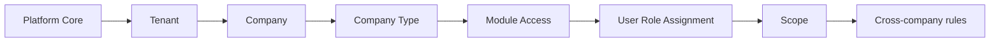
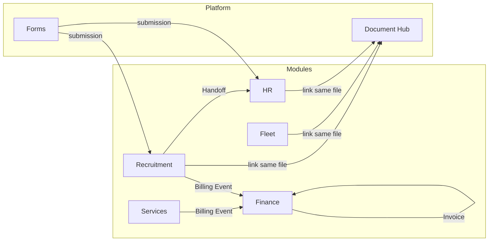

# HostFlow Core Domain Map v1

**Статус:** каноническая карта **границ домена**, **владения** и **скоупов доступа** для платформы (modular multi-company SaaS). Версия **v1** — основа для RLS, permissions API, handoff и Document Hub; **не** заменяет ERD/миграции (следующие артефакты).

**Связанные документы:** [`platform-architecture-principles.md`](platform-architecture-principles.md), [`module-catalog-and-routing-map.md`](module-catalog-and-routing-map.md), [`ADR-003`](ADR-003-tenant-company-module-data-boundaries.md), [`ADR-004`](ADR-004-five-product-modules-and-billing-events.md), [`ADR-005`](ADR-005-three-level-settings-hierarchy.md), [`ADR-009`](ADR-009-document-hub-platform-layer.md), [`ADR-010`](ADR-010-unified-resource-list-shell.md), [`ADR-011`](ADR-011-hostflow-ui-platform-standard.md), [`ADR-002`](ADR-002-modular-recruitment-hr-boundary.md), [`ADR-037`](ADR-037-lifecycle-identity-canon.md) (stage existence = Module Stage Registry; Funnel = company configuration).

---

## 1. Первая карта: порядок рассуждений (canonical flow)

Строить любую фичу **сверху вниз** в этом порядке — иначе RLS и права разъедутся.

| Шаг | Вопрос |
|-----|--------|
| **Platform Core** | Что глобально (superadmin, реестры, системные справочники)? |
| **Tenant** | Где граница подписки и биллинга? Что включено на аккаунте? |
| **Company** | **Кто владеет операционными данными?** (почти всегда **Company**, не Tenant) |
| **Company Type** | Какие presets/UI/рекомендации модулей? (не замена ACL) |
| **Module Access** | Tenant ∩ company: какие модули реально доступны этой company? |
| **User Role Assignment** | Какая роль у пользователя **в каком контексте**? |
| **Scope** | Company + module + (опц.) сущность: где действует право? |
| **Cross-company rules** | Handoff, shared access, relationship — **только явно** |

**Сильное решение:** **Company = data boundary**, не Tenant. Это уровень ERP/platform: несколько business units в одном tenant, разные модули по company, controlled sharing, marketplace.

---

## 2. Этап 1 — Platform Core (SSOT сущности)

Зафиксированные **концепты** (имена в коде/БД могут отличаться; смысл — этот):

| Концепт | Кратко |
|---------|--------|
| **Tenant** | Workspace; subscription/billing boundary; **не** владелец рабочих сущностей. |
| **Company** | **Operational + data owner**; `owner_company_id` на сущностях. |
| **Company Type** | Preset для onboarding/workflows/dashboards; один type на company. |
| **Module** | Продуктовый блок ADR-004 + shared capabilities (отдельно лицензируются). |
| **Module Access** | Эффективное «модуль включён»: f(tenant modules, company.enabled_modules, plan). |
| **User** | Учётная запись; членство в tenant. Появляется на Growth-пути только после ADR-041 **complete**, не на verify. |
| **SignupIntent** | Pre-tenant черновик регистрации (нет `tenant_id`); не User и не Tenant ([`ADR-041`](ADR-041-verified-self-service-signup.md)). |
| **Role** | Trust-роль ADR-036 (`administrator` / `employee` / `viewer` / `superadmin`). Стартовая self-service роль — `administrator`, не `owner`. |
| **Permission** | Атомарное право на действие в контексте. |
| **Scope** | Где применимо: **company_id** + **module_key** + опционально entity / ACL row. |
| **Company Relationship** | Долговременная связь agency–client, carrier agreement и т.д. |
| **Shared Access / Handoff** | Временная или контрактная передача видимости/документов между companies. |

### 2.1 Кто чем владеет (главное)

| Вопрос | Ответ |
|--------|--------|
| Кто владеет кандидатом, счётом, ТС? | **Company** (`owner_company_id`), не tenant. |
| Где «живёт» подписка? | **Tenant**. |
| Кто решает «модуль включён для работы»? | **Company** (в рамках tenant). |
| Кто видит строку? | **User** через **role + scope**; cross-company **только** по handoff/relationship/policy. |

Без этой фиксации: RLS ломается, handoff становится дырой, документы дублируются, multi-company логика рассыпается.

---

## 3. Scoped layers: GLOBAL → TENANT → COMPANY → MODULE

### 3.1 GLOBAL

| Объект / понятие | Комментарий |
|------------------|-------------|
| Platform SuperAdmin | Вне tenant-scoped бизнес-данных |
| Marketplace App Registry (каталог) | Системный каталог офферов |
| System Module Registry | Канон списка модулей/ключей |
| Countries, Languages | Справочники |
| System permission vocabulary | Имена прав (код-уровень) |
| **SignupIntent** | Pre-tenant identity draft ([`ADR-041`](ADR-041-verified-self-service-signup.md)); **нет** `tenant_id`; не RLS-tenant row |

### 3.2 TENANT SCOPED

| Объект / понятие |
|------------------|
| Subscription, plan, billing owner |
| Список модулей, доступных на аккаунте (крышка) |
| Tenant users (memberships), глобальные security policies |
| Global branding workspace, audit **настройки** tenant-уровня |
| Установки интеграций / marketplace apps **на workspace** (см. ADR-006) |

### 3.3 COMPANY SCOPED (операционные данные)

**Почти все рабочие сущности:**

| Примеры |
|---------|
| candidates, leads, vacancies, clients |
| employees (workforce), HR cases |
| vehicles, fleet assignments |
| service orders |
| billing_events, invoices |
| documents (**Document Hub**, `owner_company_id`) |

### 3.4 MODULE SCOPED (конфигурация и правила «как работает модуль у этой company»)

| Примеры |
|---------|
| Pipelines (recruitment), fleet assignment rules, HR workflow templates |
| Billing rules (finance), pricing rules (services) |
| Document templates / required sets **привязка** к company+module |
| Automation rules **в контексте** tenant+company |

*Детализация трёх уровней настроек — [`ADR-005`](ADR-005-three-level-settings-hierarchy.md) (`company_module_settings`).*

---

## 4. Bounded contexts (фиксированные границы)

| Контекст | Владеет смыслом | Не вторгается в |
|----------|----------------|-----------------|
| **Recruitment** | Lead, Candidate, Vacancy, Job Post, application pipeline | Employee record, HR contracts, fleet ops, invoices |
| **HR / Workforce** | Employee, HR case, employment, ZUS, HR documents **как процесс** | Candidate pipeline как замена employee |
| **Fleet** | Vehicle, assignment, handover, damage, inspection | HR contract storage как источник истины |
| **Services** | Catalog, order, delivery, **Billing Event** | Прямой invoice |
| **Finance** | Invoice, payment, **из Billing Events** | Бизнес-логика заказа услуги |
| **Forms** | Submission, публикация формы | Доменные инварианты модулей (делает handler) |
| **Document Hub** | Document, link, requirement, review | «Файл только внутри одной карточки» без registry |
| **Integrations** | Каналы, креды, доставка событий | Бизнес-правила найма |
| **Platform IAM** | User, role, permission, scope | Содержимое документов |

---

## 5. Ownership matrix (v1)

Матрица **обязательна** для согласованности API и RLS. «Shared» = через **Document Hub links / handoff / share record**, не дублирование файла.

| Entity | Owner (data) | Shared? | Cross-company? |
|--------|--------------|---------|----------------|
| Candidate | Company | Да | **Только** via Handoff / Shared Access |
| Employee | Company | Ограниченно | Редко, явная политика |
| Lead | Company | Да | Via handoff / campaign attribution |
| Vacancy / Job Post | Company | Внутренне | Публикация наружу ≠ cross-company data leak |
| Vehicle | Company | Опционально | По умолчанию нет |
| Fleet Assignment | Company | Внутренне | Нет |
| Service Order | Company | Внутренне | Клиентский доступ — отдельный контракт |
| Billing Event | Company | Внутренне | Нет |
| Invoice | Company | Нет | Нет |
| Document | Company (`owner_company_id`) | Да, **контролируемо** | Handoff policy + links |
| Document Template / Type (registry) | Tenant + company usage | Каталог может быть tenant-wide | — |

*Уточнения по документам — [`ADR-009`](ADR-009-document-hub-platform-layer.md).*

---

## 6. Взаимодействие модулей и потоки событий (логический)

### 6.1 Жёсткие правила

1. **Не смешивать модули:** Recruitment не хранит employee domain; Fleet не хранит HR contracts как SoT; Finance не содержит service execution logic.  
2. **Только Finance создаёт invoices** ([`ADR-004`](ADR-004-five-product-modules-and-billing-events.md)); остальные — **Billing Events**.  
3. **Нет tenant-level ownership операционных данных** — только company (исключения документировать явно).

### 6.2 Сильные стержни экосистемы

- **Document Hub** — один файл, links, multi-module review.  
- **Billing Events** — мост в Finance без invoice из модулей.  
- **Handoff model** — контролируемый cross-company доступ.

### 6.3 Поток (упрощённо)

### 6.4 Порядок внедрения в код (после карты v1)

| Этап | Содержание |
|------|------------|
| **P1b** | HTTP enforcement `company_allows_module` по scope company: старт — **Recruitment** (create / get / patch **candidate**); затем leads, vacancies, фильтрация списков по эффективным модулям company |
| **P1c** | Расширение гейтов на HR, Fleet, Services, Finance (чтение/запись по контракту модуля) |
| **P2** | Конвергенция `owner_company_id`, слой **Billing Events**, запрет прямого invoice из операционных модулей |
| **P3** | Назначения ролей `(user, company, module)` и миграция с плоского `user.role` + ACL |

**Сделано в коде (P1b, вертикальный slice):** `backend/app/services/company_module_enforcement.py` (`recruitment_candidate_list_sql_clause`, assert на candidate/vacancy) + тесты `backend/tests/api/test_recruitment_company_module_enforcement.py`.

---

## 7. Следующие артефакты (после v1)

Когда границы зафиксированы, по отдельным PR/документам:

1. ERD по сущностям + FK на `owner_company_id`  
2. DB schema migrations под links / handoff  
3. **RLS strategy** по таблице (tenant_id + company_id predicates)  
4. API boundaries (router per context, никаких «случайных» cross-company reads)  
5. Event bus / domain events (BillingEventCreated, DocumentLinked, …)  
6. Automations engine (триггеры в scope company)  
7. Workflows, queues, integrations architecture  

---

## 8. История

- **v1 (2026-05):** первая каноническая карта: flow Platform Core → Cross-company, GLOBAL/TENANT/COMPANY/MODULE scopes, bounded contexts, ownership matrix, module interaction rules, запреты.
- **v1.1 (2026-05):** §6.4 порядок внедрения в код; старт P1b (enforcement recruitment на candidate API).
- **2026-09-03:** [`ADR-041`](ADR-041-verified-self-service-signup.md) — SignupIntent is GLOBAL; User/Tenant/trial appear only at complete; OwnCompany ≠ Tenant.
- **2026-08-23:** [`ADR-037`](ADR-037-lifecycle-identity-canon.md) — lifecycle identity; stage existence is not `funnel_stages` / Candidate.stage HR lane.
