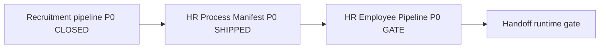

# HR Employee Pipeline P0 — architecture gate

**Status:** **Gate open — not implemented.** No implementation PR merges without this gate marked satisfied in the PR checklist.

**Prerequisite:** [`hr-process-manifest-p0.md`](hr-process-manifest-p0.md) shipped (`hr.*` PE stages registered).

**Template:** [`module-owned-pipelines-p0.md`](module-owned-pipelines-p0.md) (Recruitment company-scoped funnels — **separate module; do not reuse recruitment resolver or stages**).

**Owner:** Platform core + HR module.

**Related:**

- [`hr-process-manifest-p0.md`](hr-process-manifest-p0.md) — HR PE stage catalog (prerequisite)
- [`module-owned-pipelines-p0.md`](module-owned-pipelines-p0.md) — Recruitment pipeline gate (closed)
- [`process-engine.md`](../platform/process-engine.md) — shared evaluator; module-owned stages
- [`ADR-005-three-level-settings-hierarchy.md`](ADR-005-three-level-settings-hierarchy.md) — `HrModuleSettingsV1`
- [`invariants-recruitment-hr-document-hub.md`](invariants-recruitment-hr-document-hub.md) — HR must not depend on recruitment pipeline
- [`hr-acceptance-workflow-state-machine.md`](../workflows/hr-acceptance-workflow-state-machine.md) — logical lifecycle → `hr.*` codes

---

## 1. Problem

HR has **WorkforceEmployee** lifecycle and **`hr.*` PE stages**, but no **company-scoped operational pipeline** (funnel + stage rows + resolver) owned by `module_key=hr`.

Until this gate closes:

- HR-only tenants cannot run a coherent employee pipeline without Recruitment funnels or legacy CRM buckets.
- `HrModuleSettingsV1.employee_pipeline_funnel_id` exists in schema but is **not wired** at runtime.
- Employee stage display may fall back to ad hoc `WorkforceEmployee.status` strings instead of funnel-local codes mapped to **`hr.*` PE manifest**.

**P0 scope:** One HR employee pipeline per company (`funnel.type=employee`, `module_key=hr`). No Recruitment coupling.

---

## 2. Canon (non-negotiable)

### 2.1 Module ownership

| Owns | Does not own |
|------|----------------|
| HR: employee funnel definitions, stage labels, ordering, PE mapping (`pe_maps_to_module=hr`, `pe_maps_to_code` from manifest) | Recruitment: candidate/lead funnels |
| Company: default employee funnel via CMS + bootstrap | Tenant-wide operational HR funnels (except documented platform seed / strangler if ever needed) |
| Platform: shared `funnels` / `funnel_stages` table shape, resolver pattern | Cross-module funnel row reuse |

**Rule:** every HR operational funnel row carries **`module_key=hr`**. **`funnel.type=employee`** (new pipeline kind for this gate — distinct from `candidate` | `lead` | legacy `deal`).

### 2.2 Stages come from HR PE manifest only

- Every `funnel_stages.code` on an HR employee funnel **must** map to a registered **`hr.*` system stage** via `pe_maps_to_module` + `pe_maps_to_code`.
- **Forbidden:** recruitment stage codes (`ready_for_handoff`, `docs_wait`, …), recruitment legacy four-bucket `system_stage` as gate truth, or recruitment funnel bootstrap as HR default.
- **`system_stage` column** on `funnel_stages` (if populated) is analytics strangler only — same rule as Recruitment P0 §2.5.

### 2.3 No Recruitment dependency

An **HR-only company** (tenant/company with `hr=true`, recruitment modules off) must:

1. Bootstrap a company-scoped employee funnel when HR is enabled.
2. Resolve that funnel via **`resolve_hr_employee_funnel`** without calling recruitment resolver, recruitment CMS, or recruitment bootstrap.
3. Operate employee create / stage metadata paths using HR funnel stages only.

Optional **`candidate_id`** on `WorkforceEmployee` is historical lineage — **not** a runtime dependency on recruitment funnel resolution.

### 2.4 Handoff is out of this gate

Recruitment → HR handoff **runtime** (case creation, stage sync from `ready_for_handoff`) is **explicitly out of scope**. PE handoff placeholder from HR manifest P0 remains documentation-only until a future handoff gate.

---

## 3. Target data model

### 3.1 `funnels` (HR rows)

| Field | Value |
|-------|--------|
| `tenant_id` | RLS |
| `company_id` | Operating company FK — **required** for new HR operational rows |
| `module_key` | `hr` |
| `type` | `employee` |
| `is_default` | At most one `true` per `(company_id, module_key, type)` — reuse partial unique index from Recruitment P0 migration |

### 3.2 `funnel_stages`

- `code` — funnel-local code (may equal PE code, e.g. `handoff_pending`, `verification`).
- `pe_maps_to_module` = `hr`
- `pe_maps_to_code` — must exist in [`hr-process-manifest-p0.md`](hr-process-manifest-p0.md) §4 for tenant/platform registry.
- Stage order reflects HR employee lifecycle subset (see §4 bootstrap preset).

### 3.3 Company Module Settings

Existing field (already in schema):

```yaml
# HrModuleSettingsV1
employee_pipeline_funnel_id: uuid | null   # optional explicit default for employee pipeline
```

PATCH validates funnel belongs to **same company**, `module_key=hr`, `type=employee` (mirror recruitment CMS validation pattern).

---

## 4. Default employee pipeline preset (bootstrap)

Bootstrap runs **only** when `company_allows_module(tenant, company, "hr")` is true.

**Suggested P0 stage chain** (all codes ∈ HR manifest §4):

| order | funnel stage code | maps to `hr.*` |
|------:|-------------------|----------------|
| 10 | `handoff_pending` | `handoff_pending` |
| 20 | `accepted_by_hr` | `accepted_by_hr` |
| 30 | `hr_review_in_progress` | `hr_review_in_progress` |
| 40 | `verification` | `verification` |
| 50 | `approved_for_employment` | `approved_for_employment` |
| 60 | `employment_pending` | `employment_pending` |
| 70 | `active` | `active` |

Terminal exit stages (`returned_to_recruitment`, `rejected_by_hr`) may exist in funnel as optional branches in a later UX gate — **not required for P0 gate closure** if resolver + bootstrap + HR-only test path cover the happy path preset.

**HR-only bootstrap must not:**

- Call `bootstrap_recruitment_funnels_for_company`
- Read `RecruitmentModuleSettingsV1`
- Create `module_key=recruitment` rows

---

## 5. Funnel resolution (canonical)

Single service: **`resolve_hr_employee_funnel`**.

**Inputs:** `tenant_id`, `company_id`, optional `explicit_funnel_id`, optional `tenant` / `company` ORM objects.

**Resolution order:**

1. **`explicit_funnel_id`** (when passed): load by id; **Forbidden** if wrong company / wrong `module_key` / wrong `type` — **never fallback**.
2. **`company_module_settings.hr.settings_json.employee_pipeline_funnel_id`** if set and passes ownership check.
3. Company default: `funnels` where `(company_id, module_key=hr, type=employee, is_default=true)`.
4. **No legacy tenant-wide HR funnel** in P0 (HR gate starts company-scoped; strangler only if ADR adds pre-migration rows).
5. Optional platform seed `tenant_id='default'` for `module_key=hr`, `type=employee` — last resort (mirror recruitment step 5 if product requires).

**Errors:**

- HR module disabled for company → `403` (`HrModuleNotEnabledError` or equivalent)
- No funnel after final step → `422`
- Explicit funnel wrong company → `403` — no fallback

**Assignment helpers (planned):** `hr_employee_funnel_assignment` module mirroring `recruitment_funnel_assignment` — single runtime entry point for workforce employee create / company change reconcile.

---

## 6. Migration plan (ordered PRs)

Work proceeds in **ordered PRs**; each references this gate.

| Phase | Deliverable |
|-------|-------------|
| **H1 — Schema / type** | Allow `funnel.type=employee` in API validation; partial unique index already covers `(company_id, module_key, type)` |
| **H2 — Resolver + tests** | `resolve_hr_employee_funnel` + full chain unit/integration tests |
| **H3 — Bootstrap** | `bootstrap_hr_employee_funnel_for_company` on company create/update when HR enabled; CMS write `employee_pipeline_funnel_id` when unset |
| **H4 — Runtime wire** | Workforce employee create assigns funnel; `/meta/stages?company_id=&pipeline=employee` or HR-specific meta path; PE mapping on bootstrap |
| **H5 — API / CMS** | Funnels API list/create with `module_key=hr` + `type=employee`; CMS PATCH validation + optional UI picker (picker optional for gate) |
| **H6 — HR-only acceptance** | Automated test: HR-only tenant + company → bootstrap → resolve → stages from `hr.*` only |

**Do not merge H3 before H2 tests pass.**

---

## 7. Acceptance criteria (gate checklist)

Gate is **closed** when all are true:

- [ ] `funnel.type=employee` + `module_key=hr` operational rows are company-scoped; no new tenant-wide HR operational funnels.
- [ ] `resolve_hr_employee_funnel` implemented with tests for CMS override, company default, explicit id, module disabled, wrong-company Forbidden.
- [ ] `HrModuleSettingsV1.employee_pipeline_funnel_id` read on resolver step 2; validated on PATCH.
- [ ] Bootstrap creates employee funnel **only** when HR module enabled for company; idempotent.
- [ ] Bootstrap stages map to **`hr.*` PE manifest** only (`validate_pe_system_stage(module=hr)`).
- [ ] HR-only company integration test: **no Recruitment modules** → employee funnel resolves → stage list non-empty.
- [ ] Workforce employee create (or designated runtime path) uses HR assignment helper — not recruitment resolver.
- [ ] No runtime import of `resolve_recruitment_funnel` from HR pipeline code paths.
- [ ] Documentation: [`hr/module-scope.md`](../../hr/module-scope.md) updated with employee pipeline ownership.

---

## 8. Explicitly out of scope (this gate)

| Item | Reason |
|------|--------|
| Recruitment → HR **handoff runtime** | Separate handoff gate; placeholder only in HR manifest P0 |
| Dashboard UI / HR analytics widgets | After resolver + API stable |
| Payroll / ZUS / work permit **logic** | Workforce domain; not pipeline ownership |
| Document verification runtime | Document Hub / HR review — orthogonal |
| Fleet / Finance pipelines | Separate module keys |
| `received_from_recruitment` as **required** bootstrap stage for HR-only companies | Handoff entry stage exists in manifest for future handoff; HR-only preset starts at `handoff_pending` or `accepted_by_hr` without recruitment |
| Replacing `WorkforceEmployee.status` enum entirely | P0 may bind funnel in parallel; status migration optional follow-on |
| Full typed HR CMS UI forms | JSON editor + optional picker sufficient for gate |

---

## 9. Independence test (success criterion)

**PASS:** Provision tenant with **`modules.hr=true`**, **`recruitment` off** (no `candidates`, `leads`, `vacancies`, `recruitment`), create operating company with HR enabled → bootstrap produces **`module_key=hr`, `type=employee`** funnel → `resolve_hr_employee_funnel` returns it → funnel stages validate against **`hr.*`** registry → **zero** recruitment funnel rows required.

**FAIL examples:**

- HR resolver falls back to recruitment company default funnel.
- Bootstrap skips HR-only company because recruitment presets missing.
- Stage bootstrap copies recruitment `candidate` preset stages.

---

## 10. Prohibitions (review enforcement)

Until this gate closes, **reject in review**:

| Prohibition | Rationale |
|-------------|-----------|
| HR funnel bootstrap calling recruitment bootstrap | §2.3 |
| `resolve_hr_employee_funnel` delegating to `resolve_recruitment_funnel` | §2.3 |
| HR funnel stages with `pe_maps_to_module=recruitment` | §2.2 |
| Employee pipeline gates using recruitment legacy four-bucket `system_stage` alone | §2.2 |
| Tenant-wide HR funnel create (except documented platform seed) | §2.1 |
| Implementing handoff runtime in HR pipeline PRs | §8 |

Reference in PR title/body: `Gate: hr-employee-pipeline-p0`.

---

## 11. Planned test inventory (post-implementation)

| Area | Planned file(s) |
|------|-----------------|
| Resolver chain | `tests/services/test_hr_employee_funnel_resolver.py` |
| Bootstrap idempotency + HR gate | `tests/services/test_hr_employee_funnel_bootstrap.py` |
| CMS validation | `tests/services/test_hr_cms_employee_pipeline_funnel.py` |
| HR-only integration | `tests/integration/test_hr_only_employee_pipeline.py` |
| API company-scoped HR funnels | `tests/api/test_funnels_api_hr_employee_scope.py` |

---

## 12. Relationship to other gates



- **Recruitment P0** and **HR employee pipeline P0** are parallel module-owned patterns — not merge gates.
- **Handoff runtime** may reference `hr.received_from_recruitment` only after HR employee pipeline gate closes (or in dedicated handoff gate).

---

## History

- 2026-06-30: HR Employee Pipeline P0 gate spec — architecture only; implementation authorized after checklist in §7.
