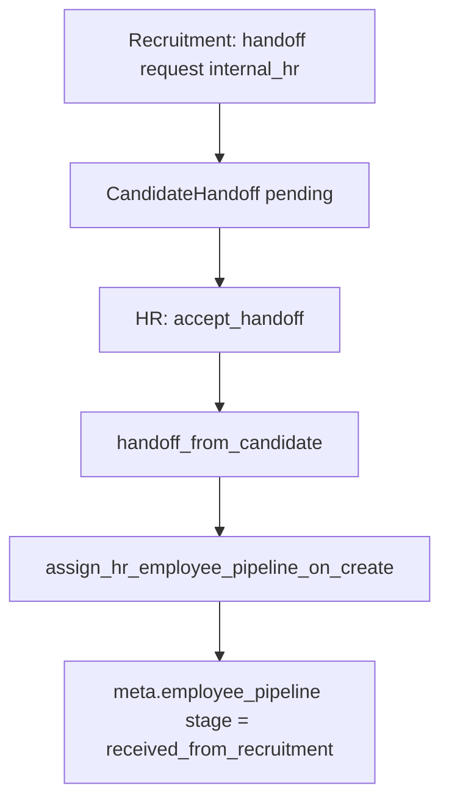

# HR Handoff Runtime P0 — architecture gate

**Status:** **OPEN** — spec only; no runtime implementation authorized until gate checklist (§7) is approved.

**Prerequisite:** [`hr-employee-pipeline-p0.md`](hr-employee-pipeline-p0.md) **CLOSED** (`PASS WITH NOTES`, 2026-06-30).

**Owner:** Platform core + HR module + Recruitment handoff contour.

**Related:**

- [`handoff-contract.md`](handoff-contract.md) — stage mapping, T1/T2/T3, idempotency (updated for PR-5 canonical path)
- [`implementation-roadmap-single-tenant-hr-handoff.md`](../workflows/implementation-roadmap-single-tenant-hr-handoff.md) — phase 1 DOD
- [`hr-process-manifest-p0.md`](hr-process-manifest-p0.md) — `received_from_recruitment` + `hr_inbound_handoff_contract_v1` placeholder
- [`hr-employee-pipeline-p0.md`](hr-employee-pipeline-p0.md) — `meta.employee_pipeline`, resolver, bootstrap (closed)
- [`invariants-recruitment-hr-document-hub.md`](invariants-recruitment-hr-document-hub.md) — HR must not depend on recruitment pipeline
- [`PR17-candidate-to-employee-handoff-spec.md`](../../PR17-candidate-to-employee-handoff-spec.md) — accept handoff, delayed workforce

---

## 1. Problem

Recruitment → HR handoff **materializes** `WorkforceEmployee` and operational context, but does **not** bind the closed HR employee pipeline (`meta.employee_pipeline`). PE manifests declare handoff target `hr.received_from_recruitment`; runtime does not assign it.

Until this gate closes:

- Handoff-created employees lack funnel/stage in `meta.employee_pipeline` while direct HR `create_employee` has it (H4).
- Entry stage `hr.received_from_recruitment` exists in PE catalog but is absent from HR bootstrap preset and handoff paths.
- `handoff-contract.md` still describes stage-driven materialization (T1) that code removed (PR-5).
- Module gates for handoff create/accept are partial (PE evaluator checks HR installed; handoff API paths inconsistent).

**P0 scope:** Wire handoff materialization to HR employee pipeline assignment with recruitment entry stage; module gates; preserve HR-only independence.

---

## 2. Canon (non-negotiable)

### 2.1 Canonical materialization path (PR-5)

| Path | Status |
|------|--------|
| **T2 — `CandidateHandoff` `destination=internal_hr` + `accept_handoff`** | **Canonical** — workforce on accept (not on create) |
| **T1 — stage change alone → `handoff_from_candidate`** | **Deprecated** — `should_workforce_handoff_on_stage_change` always `false` |
| **`POST /workforce/employees/from-candidate/{id}`** | Shortcut to `handoff_from_candidate`; must share pipeline assignment + module gates |

Single implementation choke point for pipeline binding: **`handoff_from_candidate`** (called from accept orchestrator and from-candidate API).

### 2.2 HR employee pipeline binding

On successful materialization (create or idempotent return of existing row):

1. Resolve funnel via **`resolve_hr_employee_funnel`** (same chain as H4 — CMS → company default → explicit).
2. Write **`meta.employee_pipeline`** via **`assign_hr_employee_pipeline_on_create`**.
3. For recruitment-origin materialization, set funnel-local **`pipeline_stage`** mapped to PE **`received_from_recruitment`** when that stage exists in the company HR employee funnel; otherwise fallback per §5.2.

HR-only **`create_employee`** path unchanged: default first bootstrap stage (`handoff_pending`), not `received_from_recruitment`.

### 2.3 Module independence

| Rule | Rationale |
|------|-----------|
| HR resolver/bootstrap **must not** import recruitment funnel resolver | Closed HR pipeline gate §7.4 |
| Handoff wiring **must not** require recruitment funnel rows for HR-only tenants | H6 acceptance |
| Recruitment handoff **requires** HR module enabled for `internal_hr` destination | Product boundary |
| HR-only operations **must not** require Recruitment module | H6 |

### 2.4 Graceful inactive

When a module is disabled, handoff endpoints return **403** (or documented inactive envelope) with clear reason — not 500 or silent no-op.

| Operation | HR off | Recruitment off |
|-----------|--------|-----------------|
| Create `CandidateHandoff` internal_hr | Block | Block (no recruitment handoff lane) |
| Accept internal_hr handoff | Block | N/A |
| `POST .../from-candidate` | Block | Block |
| HR `create_employee` | Block (existing) | Allowed |

---

## 3. AS-IS runtime (evidence)

| Area | Current behavior | Gap |
|------|------------------|-----|
| Accept path | `accept_internal_hr_handoff` → `handoff_from_candidate` | No `meta.employee_pipeline` |
| Handoff create | Pending only; no workforce (PR-4) | Correct; doc drift in `handoff-contract.md` B.5 |
| Direct HR create | `assign_hr_employee_pipeline_on_create` | OK |
| Entry stage | Bootstrap preset starts `handoff_pending` | Handoff should use `received_from_recruitment` when mapped |
| PE handoff rules | Recruitment → `hr.received_from_recruitment`; HR placeholder unwired | Optional G5 |
| Stage-driven | Always false | Doc still claims T1 active |
| Tests | `test_single_tenant_recruitment_hr_handoff_flow.py` — workforce + docs | No pipeline meta assertion |

**Key code paths:**

- `backend/app/services/workforce_employees.py` — `handoff_from_candidate`, `should_workforce_handoff_on_stage_change`
- `backend/app/services/hr_acceptance_orchestrator.py` — `accept_internal_hr_handoff`, `approve_employment_for_handoff`
- `backend/app/services/handoff.py` — create/accept `CandidateHandoff`
- `backend/app/services/hr_employee_funnel_assignment.py` — `assign_hr_employee_pipeline_on_create`
- `backend/app/process_engine/handoff_evaluator.py` — destination routing + HR module check

---

## 4. TO-BE (gate target)

- **Create/update** `WorkforceEmployee` remains idempotent by `candidate_id`.
- **Update** existing employee on repeat handoff: refresh `meta.employee_pipeline.stage_code` only when gate policy allows (default: no downgrade from later HR stages — see §5.3).
- **Delayed workforce** (`delayed_hr_workforce_creation_enabled`): pipeline binding at **`approve_employment_for_handoff`** materialization, same assignment helper (G2).

---

## 5. Open decisions (fix in G0 before G1 code)

### 5.1 `POST /from-candidate`

**Recommendation:** Keep for backward compatibility but apply same module gates + pipeline assignment; mark deprecated in API docs.

### 5.2 Funnel missing `received_from_recruitment` stage

**Recommendation:** Fallback to **`handoff_pending`** (first intake stage in preset) + `meta.employee_pipeline.source_handoff_fallback: true` warning flag — avoids hard 422 on legacy bootstrapped funnels.

### 5.3 Repeat handoff / existing employee

**Recommendation:** If `meta.employee_pipeline` already set with stage order ≥ intake, **no-op** stage update; always merge `internal_hr_handoff_id` in meta.

---

## 6. Explicitly out of scope (this gate)

| Item | Reason |
|------|--------|
| Payroll / ZUS / work permit logic | Workforce domain |
| Document verification runtime | Document Hub / HR review |
| HR analytics / dashboard UI | Post-gate |
| Fleet / Finance | Separate modules |
| Full PE `hr_case` entity materialization from evaluator | Optional G5 |
| Stage B split accept vs approve employment | Orthogonal unless blocking assignment |
| Requirement evidence verification on HR side | ADR-016 snapshot only at handoff |

---

## 7. Gate closure checklist (target)

Gate closes when all are true:

- [ ] `handoff_from_candidate` assigns `meta.employee_pipeline` via HR resolver (no recruitment resolver).
- [ ] Recruitment-origin materialization sets stage mapped to **`received_from_recruitment`** when present in funnel.
- [ ] `accept_internal_hr_handoff` (and delayed approve path) uses same assignment; existing tests extended.
- [ ] Module gates: HR off blocks internal_hr handoff + from-candidate; recruitment off blocks handoff create; HR-only create still passes H6.
- [ ] `handoff-contract.md` aligned with PR-5 (T2 canonical, T1 deprecated).
- [ ] Idempotency: repeat accept / existing employee — no duplicate workforce; stable pipeline meta per §5.3.
- [ ] No new recruitment → HR coupling in HR resolver/bootstrap (§2.3 regression).

**Verdict:** _pending implementation_

---

## 8. Phased delivery (authorized after gate spec approval)

| Phase | Deliverable | Tests |
|-------|-------------|-------|
| **G1** | Pipeline assignment inside `handoff_from_candidate` + entry stage | Extend assignment unit tests; handoff flow assert meta |
| **G2** | Orchestrator paths (accept + delayed approve) | `test_single_tenant_recruitment_hr_handoff_flow` |
| **G3** | Module gates on handoff create/accept + from-candidate | New API tests hr off / recruitment off |
| **G4** | Idempotency + repeat handoff meta policy | Regression tests |
| **G5** (optional) | PE evaluator → HR case stage from manifest rule | `test_process_engine_*` handoff |

**Do not merge G2 before G1 tests pass. Do not merge handoff wiring into HR bootstrap/resolver PRs.**

Reference in PR title/body: `Gate: hr-handoff-runtime-p0`.

---

## 9. Test inventory (planned)

| Area | File(s) |
|------|---------|
| Existing handoff contour | `tests/api/test_single_tenant_recruitment_hr_handoff_flow.py`, `test_handoff_internal_hr.py` |
| Snapshot / canonical | `tests/services/test_handoff_snapshot_canonical_runtime.py` |
| HR-only regression | `tests/integration/test_hr_only_employee_pipeline_h6.py` (must stay green) |
| Assignment helper | `tests/services/test_hr_employee_funnel_assignment_h4.py` (extend handoff scenario) |
| Module gates (new) | `tests/api/test_hr_handoff_module_gates_g3.py` (planned name) |

---

## 10. Prohibitions (review enforcement)

| Prohibition | Rationale |
|-------------|-----------|
| Handoff assignment calling `resolve_recruitment_funnel` | §2.3 |
| HR bootstrap adding `received_from_recruitment` as **required** HR-only stage | HR-only preset stays `handoff_pending`; handoff path sets entry |
| Stage-driven workforce reintroduced without ADR | PR-5 |
| Mixing payroll/ZUS or doc verification into handoff gate PRs | §6 |

---

## 11. Relationship to closed gates

---

## History

- 2026-06-30: Gate spec drafted after HR employee pipeline P0 closure; analysis-only, no runtime.
