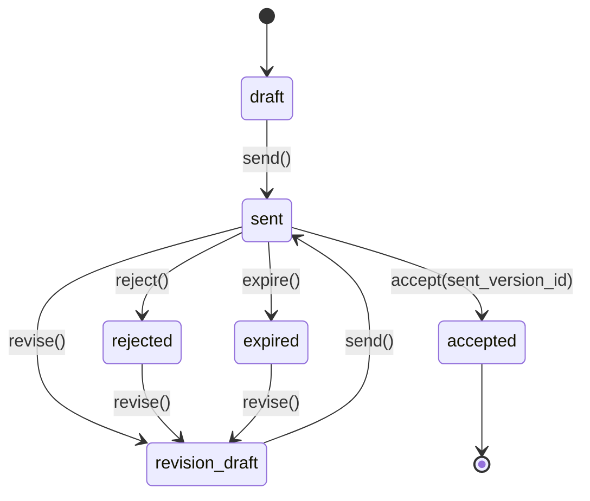

# Stage 1B — Quote Object Model

**Status:** design-first (revision 2 — addresses PR #20 review)  
**Parent:** [`stage-1b-quote-foundation-implementation-contract.md`](../tasks/stage-1b-quote-foundation-implementation-contract.md)  
**ADR:** [`ADR-020`](ADR-020-sales-to-engagement-commercial-model.md)  
**Money rules:** [`stage-1b-quote-money-arithmetic.md`](stage-1b-quote-money-arithmetic.md)

---

## 1. Position in commercial stack

```text
Sales Inquiry → ClientAccount → Quote (one negotiation thread) → ServiceOrder → …
```

**One Quote = one negotiation process** with a client. All sent revisions stay in version history on the same aggregate.

---

## 2. Aggregate design

### 2.1 Quote — stable negotiation thread

| Concern | Owner field |
|---------|-------------|
| Client | `client_account_id` (required) |
| Seller scope | `own_company_id` (required **before send**) |
| Lifecycle | `status` |
| Working revision | `current_version_id` → draft row being edited or latest sent row |
| Accepted revision | `accepted_version_id` → specific **sent** version |
| Concurrency | `lock_version` (integer, starts at 1) |
| Money context | `currency` (required) |

**Invariants:**

- `tenant_id` = `ClientAccount.tenant_id`
- `quote_number` unique per `(tenant_id, quote_number)`
- `accepted` is **terminal** for Sale layer
- `rejected` / `expired` are **recoverable** via `revise` (same Quote)

### 2.2 QuoteVersion — revision snapshot

Each row is either **draft** (mutable) or **sent** (immutable).

| Field | Notes |
|-------|-------|
| `version_number` | Monotonic per quote; starts at 1 |
| `version_status` | `draft` \| `sent` |
| `scope_snapshot` | Canonical commercial JSON (schema v1) |
| `sent_at` | Set when version becomes `sent` |
| totals | `subtotal`, `tax_total`, `total` — see money arithmetic doc |

| Rule | Detail |
|------|--------|
| Sent row immutable | No UPDATE on commercial fields after `version_status=sent` |
| Counter-offer | `POST /revise` appends new `draft` version on **same Quote** |
| History | All sent versions retained; acceptance picks one sent version by id |
| Pre-first-send | Single v1 draft edited via PATCH (no version churn) |

### 2.3 Aggregate FK — version must belong to Quote

Plain `current_version_id → quote_versions.id` is **insufficient** (could point to another quote's version).

**Required DB constraints:**

```sql
-- quote_versions
UNIQUE (quote_id, id)

-- quotes
FOREIGN KEY (id, current_version_id)
  REFERENCES quote_versions (quote_id, id)
  DEFERRABLE INITIALLY DEFERRED

FOREIGN KEY (id, accepted_version_id)
  REFERENCES quote_versions (quote_id, id)
  DEFERRABLE INITIALLY DEFERRED
```

Service checks are additive; **composite FK is mandatory**.

Insert still uses deferred FK + single transaction (insert quote → insert version → set pointers).

### 2.4 `lock_version` (optimistic locking)

| Field | Type | Rule |
|-------|------|------|
| `lock_version` | `INTEGER NOT NULL DEFAULT 1` | Increment by 1 on every successful quote mutation |

API `If-Match` carries **integer** `lock_version`, not `updated_at`.

---

## 3. Lifecycle (revision 2)

### 3.1 Status enum

`draft` | `revision_draft` | `sent` | `accepted` | `rejected` | `expired`



| Status | Meaning |
|--------|---------|
| `draft` | First proposal not yet sent; `current_version` is v1 draft |
| `sent` | Awaiting client response on **latest sent version** |
| `revision_draft` | Counter-offer after ≥1 send; `current_version` is new draft row |
| `accepted` | Sale terminal — specific `accepted_version_id` |
| `rejected` | Client declined latest sent — negotiable via `revise` |
| `expired` | Validity ended — negotiable via `revise` |

**Forbidden:** `sent → draft` (rollback). **No** new Quote after reject/expiry — same thread continues.

### 3.2 Operations

| Operation | From status | To | Version effect |
|-----------|-------------|-----|----------------|
| `PATCH` | `draft`, `revision_draft` | same | Edit current **draft** version |
| `send` | `draft`, `revision_draft` | `sent` | Freeze current draft → `sent` |
| `revise` | `sent`, `rejected`, `expired` | `revision_draft` | Append draft vN+1 |
| `accept` | `sent` | `accepted` | Set `accepted_version_id` to chosen **sent** row |
| `reject` | `sent` | `rejected` | No version mutation |
| `expire` | `sent` | `expired` | No version mutation |

### 3.3 Acceptance semantics

**Quote acceptance (Sale layer):**

- `POST /accept` requires `quote.status = sent`
- Body **must** include `version_id` referencing a row with `version_status=sent` belonging to this quote
- If omitted, defaults to **latest sent version** (`MAX(version_number) WHERE version_status=sent`)
- Sets `acceptance_source`, `accepted_by_user_id`, `accepted_at`, `accepted_version_id`
- Does **not** create Service Order

**`acceptance_source` enum (PR-1):**

`manager_phone` | `manager_email` | `client_in_person` | `client_portal` | `other`

(`client_portal` reserved; PR-1 manual entry only.)

**Not acceptance:** payment, e-sign, PO — Commerce layer.

---

## 4. `scope_snapshot` schema v1

Structured JSON — see implementation contract §4. Items in `items[]` with required commercial fields.

At send: inject `client_account`, `captured_at`; validate currency = `quotes.currency`.

---

## 5. `quote_number` generation (concurrency-safe)

Per-tenant sequence table:

```sql
quote_number_sequences (tenant_id PK, year int, last_value int)
UNIQUE (tenant_id, quote_number) on quotes
```

**Algorithm:** `SELECT … FOR UPDATE` on sequence row → increment → format `Q-{YYYY}-{last_value:06d}`.

No `MAX(quote_number)+1` without row lock.

---

## 6. Idempotency storage

Table `quote_idempotency_keys`:

| Column | Notes |
|--------|-------|
| `tenant_id` | Scope |
| `endpoint` | e.g. `POST /api/v1/quotes`, `POST …/send` |
| `idempotency_key` | Client UUID |
| `request_hash` | SHA-256 canonical JSON body |
| `response_status` | Stored replay |
| `response_body` | JSONB snapshot |
| `expires_at` | 24h TTL |

**Unique:** `(tenant_id, endpoint, idempotency_key)`

| Case | Result |
|------|--------|
| Same key + same hash | Replay stored response |
| Same key + different hash | `409 idempotency_key_reused` |
| Missing key | Normal non-idempotent behavior |

---

## 7. `own_company_id` before send

**Required before `send`:**

Resolve in order: `quote.own_company_id` → `client_account.own_company_id`.

If still null → `422 own_company_required` (do not send).

May be set on create or PATCH; not required at create time.

---

## 8. Quote → Service Order handoff (next PR)

```text
POST /api/v1/service-orders/from-quote/{quote_id}
Pre: quote.status = accepted, accepted_version_id set
Action: COPY accepted_version.scope_snapshot → service_order (no Quote mutation)
```

---

## 9. Review revision 2 — resolved items

| # | Finding | Resolution |
|---|---------|------------|
| 1 | Quote vs version contradiction | One thread; `revise` after send; no new Quote on reject |
| 2 | Weak version FK | Composite `(quote_id, id)` FK for current + accepted |
| 3 | `If-Match` on timestamp | `lock_version` integer |
| 4 | Money undefined | [`stage-1b-quote-money-arithmetic.md`](stage-1b-quote-money-arithmetic.md) |
| 5 | `acceptance_source` | Enum + `accepted_by_user_id` |
| 6 | `quote_number` concurrency | Per-tenant sequence + `FOR UPDATE` |
| 7 | Idempotency | Dedicated table; tenant+endpoint+key; hash conflict → 409 |
| 8 | `own_company_id` | Required before send |
