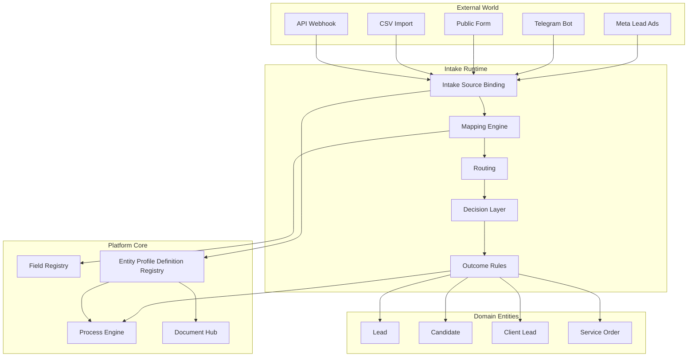

# Entity Profile Definition Registry — platform capability canon (P0)

**Status:** Accepted (architecture canon). **Implementation:** P0 canon accepted; **P1 complete**; **P2 complete**; **P3 complete**; **P4 complete**; **P5A complete** (Form Presentation Runtime foundation); **P5B complete** (Outcome Executor expansion); **P5C complete** (Lead-first public intake draft session); **P6 complete** (Intake Source / Form Builder UI foundation); **P7 complete** (Public Form Runtime Wiring); **P8 complete** (Intake Source CRUD + Presentation Write API).  
**Hierarchy:** L2 operating canon — platform layer. **Composition layer** between Field Registry and Intake / Process runtime.  
**Owner:** Architecture canon + platform core team.

> **CL0 (2026-08-23):** Entity Profile is a **role manifest** ([brief](../tasks/entity-field-composition-cl0-contract-seal.md)). Baseline presence on a Profile field is `member` / `intake` / `card_save` only. `transition` / `handoff` / `transition_level` are **not** Profile-field properties — they belong to Process Profile / Transfer Policy. `screening_pack_code` is a **ref** (same class as `document_pack_code` / `default_layout_code` / `process_profile_code`). Runtime schema columns may remain until a later CL migration; new code must not treat transition/handoff as Profile-field required. Docs only in CL0 — **do not drop DB columns in this slice**.

### P1 implementation status (2026-06-22)

| Deliverable | Status | Location |
|-------------|--------|----------|
| Alembic migration | Done | `backend/alembic/versions/202608220001_entity_profile_p1.py` |
| ORM models | Done | `backend/app/models/entity_profile.py` |
| Recruitment manifest | Done | `backend/app/entity_profile/manifests/recruitment.py` |
| Registry upsert + validation | Done | `backend/app/entity_profile/registry.py` |
| Read-only resolver | Done | `backend/app/entity_profile/resolver.py` |
| Tenant seed | Done | `backend/app/entity_profile/seed.py` → wired in `backend/app/seed.py` |
| Read API | Done | `GET /api/v1/platform/entity-profiles/{profile_code}` |
| Tests | Done | `backend/tests/entity_profile/test_entity_profile_p1.py` |

**P1 acceptance:** `GET /api/v1/platform/entity-profiles/recruitment.candidate.driver_ce` returns fields with embedded Field Registry definitions (`field.qualified_code`, `field.field_type`, …) — not ad-hoc JSON strings.

**Not changed in P1 (by design):** Form Builder UI, write API, intake runtime binding, outcome rules, automatic Candidate creation, full `CandidateProfile` migration.

### P2 implementation status (2026-06-22)

| Deliverable | Status | Location |
|-------------|--------|----------|
| Dual-read facade | Done | `backend/app/entity_profile/facade.py` |
| Legacy CandidateProfile bridge | Done | `backend/app/entity_profile/legacy_bridge.py` |
| Explicit-not-found error | Done | `EntityProfileNotFoundError` — no silent fallback to legacy |
| Intake Source `entity_profile_code` | Done | `intake_source_profiles.entity_profile_code` + `IntakeRoutingResult` |
| Resolve API | Done | `GET /api/v1/platform/entity-profiles/resolve` |
| Tests | Done | `backend/tests/entity_profile/test_entity_profile_p2.py` |

**P2 bridge rules (runtime):**

| Situation | Behaviour |
|-----------|-----------|
| `entity_profile_code` specified and found | Read Entity Profile Registry |
| `entity_profile_code` specified and not found | **Error** (`EntityProfileNotFoundError` / HTTP 404) |
| `entity_profile_code` not specified | Legacy fallback via `candidate_profile_id` / `candidate_profile_code` |
| Legacy field key unknown to Field Registry | Transitional warning (`legacy_unknown_field:*`), not new canon |

**Not changed in P2 (by design):** `CandidateProfile.config` removal, Form Builder UI, write API, Outcome Rules runtime, automatic Candidate creation, full profile migration.

### P3 implementation status (2026-06-22)

| Deliverable | Status | Location |
|-------------|--------|----------|
| Ingest runtime bridge | Done | `backend/app/entity_profile/ingest_runtime.py` |
| Mapping validation (profile-scoped targets) | Done | `backend/app/entity_profile/mapping_validation.py` |
| Legacy reverse map | Done | `backend/app/entity_profile/reverse_map.py` |
| Meta ingest wiring | Done | `backend/app/modules/leads/service/_bulk.py` → `prepare_meta_ingest_runtime()` |
| Public intake wiring | Done | `backend/app/api/public/intake.py` → `prepare_public_intake_runtime()` |
| Ingest envelope contract | Done | `ingest_envelope_v1` on lead/candidate normalized payload |
| Tests | Done | `backend/tests/entity_profile/test_entity_profile_p3.py` |

**P3 hard rule (runtime):** mapping targets must resolve to `qualified_code` values **included in the selected Entity Profile**. Targets outside the profile are **rejected** — Meta/public intake cannot write into arbitrary Field Registry fields (e.g. client or HR fields on a driver profile).

**P3 ingest envelope (`ingest_envelope_v1`):**

| Field | Purpose |
|-------|---------|
| `raw_payload_stored` | Raw provider payload preserved separately |
| `entity_profile_code` | Resolved from Intake Source (or explicit override) |
| `route_intent` | From Intake Router |
| `mapping_result` | Accepted/rejected rules + warnings |
| `warnings` | Bridge + validation warnings |
| `resolution_source` / `bridge_source` | Registry vs legacy path |
| `intake_source_profile_id` | Bound intake source when matched |

**P3 bridge rules (legacy path):**

| Situation | Behaviour |
|-----------|-----------|
| `legacy_candidate_profile_code` has reverse map | Resolve Entity Profile Registry; warning `legacy_reverse_map_applied` |
| No reverse map | Legacy `CandidateProfile.config` path; warning `legacy_reverse_map_missing` |
| Explicit `entity_profile_code` on Intake Source | Registry path; mapping validated against profile fields |

**Not changed in P3 (by design):** Form Builder UI, write API, Outcome Rules runtime, automatic Candidate creation, `CandidateProfile` removal, full profile migration.

### P4 implementation status (2026-06-22)

| Deliverable | Status | Location |
|-------------|--------|----------|
| Decision input contract | Done | `backend/app/entity_profile/decision_layer.py` — `DecisionInput` from `ingest_envelope_v1` |
| Decision evaluation | Done | `evaluate_ingest_decision()` — outcome rules + dedup + auto-convert gates |
| Outcome executor | Done | `backend/app/entity_profile/outcome_executor.py` — gated Candidate creation |
| Meta ingest wiring | Done | `backend/app/modules/leads/service/_processing.py` |
| Public intake Lead record | Done | `backend/app/entity_profile/public_intake_bridge.py` + submit path |
| Vacancy → entity profile | Done | `backend/app/entity_profile/vacancy_bridge.py` |
| Reverse-map expansion | Done | `STATIC_LEGACY_CANDIDATE_PROFILE_TO_ENTITY` — `driver_ce_default`, `poltrakt_drivers`, `base` |
| Tests | Done | `backend/tests/entity_profile/test_entity_profile_p4.py` |

**P4 runtime chain:**

```
Input → Ingest Envelope → Decision Input → Outcome Decision → Object Creation → Process Start
```

**P4 decision blocks on normalized payload:**

| Block | Purpose |
|-------|---------|
| `decision_input_v1` | Entity profile, route intent, vacancy/company context from envelope |
| `decision_result_v1` | Disposition: `lead_only`, `create_candidate`, `blocked_duplicate`, `needs_routing`, `review_queue` |

**P4 hard rule:** ingest handlers **do not** call `create_candidate_full` directly. Candidate INSERT runs only when `decision_result_v1.disposition == create_candidate` via `execute_create_candidate_outcome()`.

**P4 architectural outcome (accepted):**

Ingest **no longer owns Candidate creation**. It normalizes input, creates/updates **Lead** as the intake record, and passes disposition to Decision Layer.

```
Source → Lead → Decision → Outcome → Entity
```

| Gain | Detail |
|------|--------|
| Lead as intake record | Lead is primary, not a side-effect of conversion |
| Outcome-gated entities | Duplicate, fit, vacancy gates, routing, profile mapping, future Process Start — all downstream of decision |
| Unified Meta + public path | Same ingest envelope + decision contract; no parallel legacy handlers |
| Vacancy bridge | Vacancy can resolve `entity_profile_code` when intake source does not specify it |
| Duplicate as outcome | `blocked_duplicate` is an architectural disposition, not a local `if` in ingest |

**Not changed in P4 (by design):** Form Builder UI, write API, Process Engine deep integration, Document Hub auto-pack, `CandidateProfile` removal, public intake draft session UX (existing draft Candidate row remains transitional — see **P5C**).

### P5A implementation status (2026-06-22)

| Deliverable | Status | Location |
|-------------|--------|----------|
| Presentation resolver | Done | `backend/app/entity_profile/presentation_runtime.py` |
| Runtime contract | Done | `form_presentation_runtime_v1` — display-only, no decisions |
| Read API | Done | `GET /api/v1/platform/entity-profiles/{code}/presentations/{presentation_code}` |
| Resolve API | Done | `GET /api/v1/platform/entity-profiles/presentations/resolve` |
| Intake source binding | Done | `resolve_form_presentation_for_intake_source()` |
| Tests | Done | `backend/tests/entity_profile/test_entity_profile_p5a.py` |

**P5A runtime contract (`form_presentation_runtime_v1`):**

| Field | Purpose |
|-------|---------|
| `contract_version` | `form_presentation_runtime_v1` |
| `entity_profile_code` | Source Entity Profile |
| `presentation_code` | `ep_intake_presentations.presentation_code` |
| `fields[]` | Subset only — embedded Field Registry + label overrides |
| `ownership` | Always `display_only` — Form Runtime does not decide outcomes |
| `warnings` | e.g. `presentation_field_not_in_profile:*` for corrupt DB rows |

**P5A acceptance:** `recruitment.candidate.driver_ce` + `recruitment.candidate.driver_ce.meta_short` returns exactly 3 fields (Imię, Nazwisko, Telefon) with Field Registry embed — no UI, no write path.

**Not changed in P5A (by design):** Form Builder UI, drag-and-drop, write API, public intake UI wiring, Lead-first draft (P5C), executor expansion (P5B — see **P5B** below).

### P5B implementation status (2026-06-22)

| Deliverable | Status | Location |
|-------------|--------|----------|
| Outcome types | Done | `create_client`, `create_service_order` in `IngestDisposition` + outcome rules |
| Decision Layer | Done | `evaluate_outcome_event_decision()` — lifecycle events (`won`, `qualified`) |
| Payload mapping | Done | `backend/app/entity_profile/outcome_payload_mapping.py` |
| Client conversion | Done | `backend/app/modules/leads/lead_client_conversion.py` |
| Service order conversion | Done | `backend/app/modules/leads/lead_service_order_conversion.py` |
| Provider-agnostic executor | Done | `execute_outcome_decision()` in `outcome_executor.py` |
| Idempotency | Done | `converted_client_id` / `normalized.service_order_id` replay |
| Tests | Done | `backend/tests/entity_profile/test_entity_profile_p5b.py` |

**P5B acceptance:** Decision Layer returns `create_client` (sales + `won`) and `create_service_order` (service + `qualified`); executor creates derivative entities without provider branching; Lead remains intake record linked via `converted_client_id` or `normalized.service_order_id`; repeat submit does not duplicate.

**Not changed in P5B (by design):** Form Builder UI, Mapping UI, provider-specific logic, frontend, Sales pipeline automations, billing, Document Hub, `_processing.py` lifecycle wiring for `won`/`qualified` events (executor API ready; callers invoke when stage transitions fire).

### P5C implementation status (2026-06-22)

| Deliverable | Status | Location |
|-------------|--------|----------|
| Lead-first draft session | Done | `backend/app/entity_profile/public_intake_draft_session.py` |
| Public intake create (no Candidate INSERT) | Done | `POST /public/intake` → `create_or_reuse_public_intake_lead_draft()` |
| Decision bridge on submit | Done | `submit_public_intake_lead_draft()` → Decision Layer + `execute_outcome_decision()` |
| Legacy Candidate draft compatibility | Done | `resolve_public_intake_session()` fallback |
| Lead-draft document upload (presign/PUT/complete) | Done | `pending_documents` on `Lead.normalized.public_intake_draft_v1` |
| Tests | Done | `backend/tests/entity_profile/test_entity_profile_p5c.py`, `tests/api/test_public_intake.py` |

**P5C acceptance:** Public create stores Lead draft (no transitional `Candidate()`); submit runs Decision Layer; `create_candidate` only via Outcome Executor; duplicate submit does not create a second Candidate; legacy in-flight Candidate-backed tokens still work.

**Not changed in P5C (by design):** Form Builder UI, Mapping UI, write API, full draft edit sessions, frontend submission wizard, `CandidateProfile` removal, pending-document migration to Candidate on submit (files stay on lead draft until outcome).

**Canonical chain after P5C:**

```
Input Payload → Ingest Envelope → Lead/Draft → Decision → Outcome Executor → Candidate | Client | Service Order
```

**Canonical chain (HostFlow intake architecture):**

```
Field Registry
    ↓
Entity Profile Definition Registry
    ↓
Intake Source (Forms, Meta, Telegram, WhatsApp, CSV, API, …)
    ↓
Mapping
    ↓
Routing
    ↓
Decision Layer
    ↓
Outcome Rules
    ↓
Process Engine
```

**Product canon (EN):**

> Forms are not the source of data semantics. Forms are presentation and intake surfaces over canonical Entity Profiles backed by Field Registry.

**Product canon (RU):**

> Формы не определяют смысл данных. Формы являются поверхностью ввода над каноническими профилями объектов, основанными на Field Registry.

---

## Decision (canon)

**Entity Profile Definition Registry lives in Platform Core.**

It is **not** a business module. It is **not** a Form Builder. It is **not** a UI template system.

It is the **missing composition layer** that answers:

> *Which canonical fields form a specific business object type?*

Business modules **declare** Entity Profiles in their namespace. Intake Sources, card layouts, document packs, and Process Engine profiles **reference** Entity Profiles — they **must not** invent parallel field semantics.

**Reference layer first, runtime layer second.** Form Builder UI is **not** the starting point for this architecture.

---

## 1. Purpose

### 1.1 What this layer solves

HostFlow already has:

| Layer | Status | Answers |
|-------|--------|---------|
| **Field Registry** | P1–P5 implemented | What does each field **mean**? |
| **Process Engine** | P0–P6 closed | What **process** runs next? |
| **Intake Routing** | Foundation spec | Where does inbound payload **route**? |

**Missing:** a registry that binds canonical fields into **typed business object profiles** — the business data model between Field Registry and all consumers.

Without Entity Profile Definition Registry:

- each Form invents its own field set;
- `CandidateProfile.config` remains a monolithic JSON blob mixing layout, process, and documents;
- Meta / Telegram / public forms diverge into `first_name`, `candidate_name`, `name`, `full_name`;
- Mapping Engine has no stable target beyond ad-hoc strings;
- Process Engine profiles float without explicit entity field composition.

### 1.2 What Entity Profile is **not**

| Wrong mental model | Correct model |
|--------------------|---------------|
| UI form template | Business object field composition |
| Form Builder preset | Curated subset of Field Registry |
| Intake Source config | Persistent object type definition |
| Card layout JSON | May **reference** `default_layout_code`; layout lives in Field Registry |
| Process Profile | May **reference** `process_profile_code`; process rules live in Process Engine |

**One Entity Profile → many Forms / Intake Sources.**  
**One Entity Profile → one primary `entity_type`.**  
**Many Entity Profiles → same underlying canonical fields** (e.g. `platform.identity.phone` appears in candidate and employee profiles).

---

## 2. Terminology

### 2.1 Canonical terms (use these)

| Term | Definition |
|------|------------|
| **Field Registry** | Platform registry of canonical field definitions (`qualified_code`, type, normalization, storage binding). |
| **Entity Profile** / **Entity Profile Definition** | Composition record: which canonical fields belong to a business object type. |
| **Entity Profile Definition Registry** | Platform Core store + resolver for Entity Profiles. |
| **Intake Source** | External entry point (Meta form, public form, Telegram bot, CSV batch, API webhook). Produces **Input Payload**. |
| **Form Presentation** | UI/intake surface: which fields to **ask now** from an Entity Profile subset. |
| **Mapping** | Rules: external field → `qualified_code` from Field Registry. |
| **Routing** | Operating context: intent, assignee, company scope, pipeline preset. |
| **Decision Layer** | Dedup, identity resolution, profile fit, create vs triage vs update. |
| **Outcome Rules** | What entities to create after decision (Lead always; Candidate / Client / Service Order conditionally). |
| **Process Profile** | Process Engine registry entry: pipeline, gates, handoff, field requirements at transition. |

### 2.2 Deprecated / ambiguous terms (avoid)

| Term | Problem | Use instead |
|------|---------|-------------|
| **Profile Template** | Implies UI template | **Entity Profile Definition** |
| **Intake Source Profile** | Collides with Entity Profile | **Intake Source Config** or **Intake Route** |
| **CandidateProfile** (as architecture term) | Legacy monolith | **Entity Profile** `recruitment.candidate.driver_ce` + bridge during migration |
| **Form template** (as data model) | Implies fields are born in the form | **Form Presentation** over Entity Profile |

### 2.3 Legacy name collision map

Today **four different "profile" concepts** exist in code/docs:

| Legacy artifact | Actual role today | Target |
|-----------------|-------------------|--------|
| `CandidateProfile` | fields + docs + gates + funnel in JSON | Split → **Entity Profile** + Process Profile + layout + document pack refs |
| `pe_process_profiles` | Process Engine pipeline/gates/handoff | **Process Profile** (unchanged owner: Process Engine) |
| `intake_source_profiles` | Routing intent, assignee, pipeline preset | Rename conceptually → **Intake Source Config** |
| `fr_card_layout_profiles` | Card section/field visibility | **Card Layout** in Field Registry (unchanged) |

---

## 3. Layer responsibilities

| Layer | Question it answers | Owner |
|-------|---------------------|-------|
| **Field Registry** | What does this field **mean**? | Platform Core |
| **Entity Profile Definition** | Which fields **belong to this object type**? | Platform Core + registering module |
| **Form / Intake Source** | Which fields do we **ask now**? | Intake / Integrations |
| **Mapping** | How do external keys map to **canonical fields**? | Intake adapters |
| **Routing** | Where does this payload **go** (intent, scope, assignee)? | Intake Routing |
| **Decision Layer** | Create, update, triage, or reject? | Platform intake runtime |
| **Outcome Rules** | Which **entities** to instantiate? | Intake + module handlers |
| **Process Engine** | Which **process** and transitions apply? | Process Engine |

**Hard rule — forms do not create field semantics:**

A Form / Intake Source **may**:

- select fields from an Entity Profile;
- set label / placeholder / help text (presentation overrides);
- set field order in the intake UI;
- show or hide fields in this intake context;
- mark fields required in the **`intake`** requirement context.

A Form / Intake Source **must not**:

- create new semantic fields (`first_name_2`, `candidate_name`, `driver_name`) without a Field Registry entry;
- define normalization or storage binding;
- become the source of truth for what fields exist on an object.

---

## 4. Entity Profile — definition

### 4.1 Question

> **Which canonical fields form this business object type?**

Examples:

| `profile_code` | Meaning |
|----------------|---------|
| `recruitment.candidate.driver_ce` | Driver candidate profile (C+E) |
| `recruitment.candidate.warehouse_worker` | Warehouse worker candidate |
| `hr.employee.driver_ce` | Employed driver operational profile |
| `crm.client.carrier` | Transport carrier company |
| `crm.client.lead` | Prospective B2B client |
| `recruitment.vacancy.driver_ce` | Driver C+E vacancy requirements |
| `services.service_order.driver_staffing` | Client request for driver staffing |

### 4.2 Minimum composition (P0 model)

| Block | Purpose | References |
|-------|---------|------------|
| `entity_type` | Primary entity kind | `candidate`, `workforce_employee`, `company`, `vacancy`, `service_order`, … |
| `profile_code` | Stable qualified identifier | Unique per tenant or platform seed; `{module}.{entity}.{variant}` |
| `module_owner` | Registering business module | `recruitment`, `hr`, `crm`, `services`, `fleet`, … |
| `fields[]` | Canonical field membership | List of `qualified_code` from Field Registry |
| `requirement_contexts` | When fields are required | Per-field overrides for baseline presence: `intake`, `card_save` only. `transition` / `handoff` live on Process Profile / Transfer Policy ([CL0](../tasks/entity-field-composition-cl0-contract-seal.md)) |
| `default_layout_code` | Card presentation default | Field Registry layout profile code |
| `document_pack_code` | Related documents | Document Hub pack / requirement set |
| `screening_pack_code` | Screening / qualification pack | Screening pack ref — **not** `required=true` on a field ([CL0](../tasks/entity-field-composition-cl0-contract-seal.md)) |
| `process_profile_code` | Default process binding | Process Engine `pe_process_profiles.code` |
| `name`, `description` | Operator-facing labels | i18n-ready display metadata |
| `is_active`, `version` | Lifecycle | Soft disable; version for migration |

### 4.3 Example (YAML — illustrative)

```yaml
profile_code: recruitment.candidate.driver_ce
entity_type: candidate
module_owner: recruitment
name: Driver Candidate (C+E)
fields:
  - qualified_code: platform.identity.first_name
    intake: required
    card_save: required
  - qualified_code: platform.identity.last_name
    intake: required
  - qualified_code: platform.identity.phone
    intake: required
  - qualified_code: platform.identity.citizenship
    intake: optional
  - qualified_code: recruitment.candidate.driving_license_categories
  - qualified_code: recruitment.candidate.code95
  - qualified_code: recruitment.candidate.driver_card
default_layout_code: recruitment.candidate.driver_ce
document_pack_code: recruitment.driver_ce_documents
screening_pack_code: recruitment.driver_ce_screening
process_profile_code: recruitment.driver_ce_default
```

### 4.4 Form Presentation (separate record)

A Meta lead form asking only name + phone **references** the same Entity Profile with an **`intake_field_subset`**:

```yaml
intake_source:
  provider: meta
  external_key: form_id:123456
  entity_profile_code: recruitment.candidate.driver_ce
  intake_field_subset:
    - platform.identity.first_name
    - platform.identity.last_name
    - platform.identity.phone
  presentation:
    platform.identity.first_name:
      label_override: "Imię"
    platform.identity.phone:
      label_override: "Telefon"
```

The Entity Profile still defines all 50 fields for the full candidate card. The form only **surfaces three** at intake time.

---

## 5. Architecture relationships

### 5.1 Field Registry → Entity Profile

- Entity Profile **`fields[]`** entries **must** reference existing `qualified_code` values in Field Registry.
- Entity Profile **does not duplicate** field semantics (type, normalization, storage, PII class).
- Field Registry **`requirement_contexts`** provide defaults for `intake` / `card_save`; Entity Profile may override those two. `transition` / `handoff` defaults belong to Process Profile ([CL0](../tasks/entity-field-composition-cl0-contract-seal.md)).
- Resolver: `resolve_entity_profile(profile_code) → { fields with effective requirements }`.

### 5.2 Entity Profile → Intake Sources

- Every Intake Source binding **must** reference an `entity_profile_code`.
- Intake Source defines **provider**, **external_key**, **intake_field_subset**, **mapping rules**, **route intent**.
- Public Form is **one provider type** inside Intake Sources — not a peer architecture module at this layer.
- All providers produce the same artifact: **Input Payload** (normalized envelope).

See: [`intake-routing-foundation.md`](../modules/intake-routing-foundation.md) — Routing and bindings; Entity Profile replaces ambiguous "what object type is this intake for?".

### 5.3 Entity Profile → Process Engine

- Entity Profile carries **`process_profile_code`** — default Process Profile for new entities created from this profile.
- Process Engine **`pe_field_requirements`** continue to reference **`qualified_code`** from Field Registry.
- Entity Profile is the **composition**; Process Profile is the **behaviour** (pipeline, gates, handoff).
- Vacancy / Intake Source may override `process_profile_code` explicitly (linked mode).

See: [`process-engine.md`](process-engine.md) — Process Profile Registry; Entity Profile does not replace Process Engine.

### 5.4 Entity Profile → Document Hub

- Entity Profile references **`document_pack_code`** — required document set for this object type.
- Document Hub owns verification state; Entity Profile owns **which pack applies**.

See: [`ADR-009`](../architecture/ADR-009-document-hub-platform-layer.md).

### 5.5 Entity Profile → Decision Layer & Outcome Rules

**Decision Layer** (to be implemented as explicit runtime service):

1. Normalize payload via Mapping → Field Registry codes.
2. Resolve Entity Profile from Intake Source binding.
3. Dedup / identity resolution (phone, email, external_id).
4. Profile fit — does payload match expected profile?
5. Decision: `create` | `update` | `triage` | `reject`.

**Outcome Rules** (after decision):

1. Always create/update **Lead** (universal intake record).
2. Conditionally create **Candidate**, **Client Lead**, **Service Order**, etc.
3. Bind **Process Profile** and start Process Engine instance.
4. Assign manager, enqueue notifications, register documents.

**HostFlow competitive principle:**

> The user submits data. The system decides who they are, whether a duplicate exists, which profile fits, which process to start, which documents are needed, and which manager gets the task.

Not: `Submission → Candidate`.

Canonical flow:

```
Submission → Decision Layer → Object Creation (+ Process Start)
```

---

## 6. Full runtime chain (reference)



---

## 7. Minimum data model (P0 target schema)

**Tables (names illustrative — implementation ADR may refine):**

### 7.1 `ep_entity_profiles`

| Column | Type | Description |
|--------|------|-------------|
| `id` | UUID | PK |
| `tenant_id` | UUID | RLS scope; NULL = platform seed |
| `profile_code` | string(128) | Qualified code, unique per tenant |
| `entity_type` | string(64) | `candidate`, `workforce_employee`, `company`, … |
| `module_owner` | string(32) | Registering module |
| `name` | string(255) | Display name |
| `description` | text? | |
| `default_layout_code` | string(128)? | FK ref → Field Registry layout |
| `document_pack_code` | string(128)? | FK ref → Document Hub pack |
| `screening_pack_code` | string(128)? | FK ref → screening pack (CL0; docs only — column may be added in a later CL migration) |
| `process_profile_code` | string(128)? | FK ref → `pe_process_profiles.code` |
| `is_active` | bool | |
| `version` | int | Monotonic profile version |
| `created_at`, `updated_at` | timestamptz | |

**Unique:** `(tenant_id, profile_code)`

### 7.2 `ep_entity_profile_fields`

| Column | Type | Description |
|--------|------|-------------|
| `id` | UUID | PK |
| `entity_profile_id` | UUID FK | |
| `qualified_code` | string(128) | FK logical ref → Field Registry |
| `sort_order` | int | Default field order |
| `intake_level` | enum? | `required` / `optional` / `hidden` |
| `card_save_level` | enum? | Override for card save context |
| `transition_level` | enum? | **Deprecated (CL0).** Must not be used as Profile-field required. Canon owner = Process Profile / Transfer Policy. Column may remain until a later CL migration — **do not DROP in CL0**. |
| `is_active` | bool | |

**Unique:** `(entity_profile_id, qualified_code)`

### 7.3 `ep_intake_presentations` (Form / Intake UI layer)

| Column | Type | Description |
|--------|------|-------------|
| `id` | UUID | PK |
| `tenant_id` | UUID | |
| `entity_profile_id` | UUID FK | Parent profile |
| `intake_source_binding_id` | UUID? FK | Optional link to intake binding |
| `presentation_code` | string(128) | e.g. `meta-driver-ce-short` |
| `field_subset` | jsonb | Ordered list of `qualified_code` |
| `presentation_overrides` | jsonb | Label/placeholder/help per field |
| `is_active` | bool | |

**Rule:** every `qualified_code` in `field_subset` **must** exist in parent Entity Profile `fields[]`.

---

## 8. Migration map — `CandidateProfile.config` → Entity Profile

**Strategy:** strangler fig — same pattern as Field Registry and Process Engine.

### 8.1 What `CandidateProfile` mixes today

| Fragment in `CandidateProfile.config` | Target owner |
|---------------------------------------|--------------|
| `field_configs[]` (visible, required, order) | **Entity Profile fields** + Field Registry **layout** |
| `document_configs[]` | **document_pack_code** → Document Hub |
| gates / funnel fragments | **process_profile_code** → Process Engine |
| `funnel_id` | Vacancy / Process Profile binding (unchanged column, clearer semantics) |
| `pe_process_profile_id` (column) | Direct link — **keep**; Entity Profile aligns with same code |

### 8.2 Migration phases (recommended)

| Phase | Deliverable | Legacy shim |
|-------|-------------|-------------|
| **P0 — Canon** | This document + cross-links | None |
| **P1 — Registry schema** | `ep_entity_profiles` + fields + presentations; read API | `CandidateProfile` unchanged at runtime | **Done** |
| **P2 — Dual-read bridge** | Facade + legacy CandidateProfile bridge + intake `entity_profile_code` | Legacy profiles keep working | **Done** |
| **P2 — Seed from legacy** | Import `candidate_profiles` rows → Entity Profile seeds | Dual-read: effective profile resolver checks EP registry first, falls back to config JSON |
| **P3 — Intake runtime bridge** | Ingest handlers call facade; mapping validated against Entity Profile fields; `ingest_envelope_v1` contract | Meta/public intake uses profile code; legacy reverse-map transitional | **Done** |
| **P4 — Decision Layer bridge** | `DecisionInput` / `decision_result_v1`; outcome executor gates Candidate creation | Lead always; Candidate only via outcome decision | **Done** |
| **P5A — Form Presentation Runtime** | Read API / resolver: fields for public/Meta from Entity Profile + `ep_intake_presentations` | Form runtime reads subset; **no Form Builder UI** | **Done** |
| **P5B — Executor expansion** | `create_client`, `create_service_order` outcome paths | Decision Layer executor; provider-agnostic | **Done** |
| **P5C — Lead-first draft session** | Public intake draft without transitional `Candidate()` insert | Lead/session token; draft state on intake record | **Done** |
| **P6 — Intake Source / Form Builder UI foundation** | Settings list + detail; P5A preview; public link; smoke test | Read-only admin UI; no canon writes | **Done** |
| **P7 — Public Form Runtime Wiring** | Public form reads `form_presentation_runtime_v1`; submit maps `qualified_code`; required validation | Legacy public intake unchanged when no IntakeSource binding | **Done** |
| **P8 — Intake Source CRUD + Presentation Write API** | Create/update public forms; persist `ep_intake_presentations`; field subset validation | UI selects Entity Profile fields only | **Done** |
| **P6+ — Bridge removal** | Stop writing `field_configs` outside layout editor | `CandidateProfile.config` deprecated |
| **Closure gate** | Guards: no new semantic fields outside Field Registry + Entity Profile | Remove config JSON field matrix |

### 8.3 Code anchors

| Artifact | Location |
|----------|----------|
| Entity Profile models | `backend/app/models/entity_profile.py` |
| Registry + resolver | `backend/app/entity_profile/` |
| Read API | `backend/app/api/v1/platform/entity_profiles.py` |
| P1 tests | `backend/tests/entity_profile/test_entity_profile_p1.py` |
| `CandidateProfile` model (legacy) | `backend/app/models/candidate_profile.py` |
| Profile API + canonical field list | `backend/app/api/v1/candidate_profiles.py` |
| Layout bridge | `backend/app/field_registry/` (effective layout overlay) |
| Process Profile bridge | `candidate_profiles.pe_process_profile_id` |
| Meta intake mapping | `backend/app/modules/leads/field_mapping_resolve.py` |
| Meta ingest runtime | `backend/app/modules/leads/service/_bulk.py` |
| Ingest runtime + mapping validation | `backend/app/entity_profile/ingest_runtime.py`, `mapping_validation.py`, `reverse_map.py` |
| P3 tests | `backend/tests/entity_profile/test_entity_profile_p3.py` |
| Decision Layer + outcome executor | `backend/app/entity_profile/decision_layer.py`, `outcome_executor.py` |
| Vacancy bridge | `backend/app/entity_profile/vacancy_bridge.py` |
| P4 tests | `backend/tests/entity_profile/test_entity_profile_p4.py` |
| Form Presentation Runtime | `backend/app/entity_profile/presentation_runtime.py` |
| P5A tests | `backend/tests/entity_profile/test_entity_profile_p5a.py` |
| P5B tests | `backend/tests/entity_profile/test_entity_profile_p5b.py` |
| P6 tests | `backend/tests/api/test_intake_forms_settings.py` |
| P6 UI | `hostflow-frontend/src/pages/admin/IntakeFormDetailPage.tsx` |
| P7 presentation bridge | `backend/app/entity_profile/public_intake_presentation_bridge.py` |
| P7 tests | `backend/tests/api/test_public_intake_presentation_p7.py` |
| P7 public UI | `hostflow-frontend/src/pages/public/PublicIntakePresentationForm.tsx` |
| P8 presentation write | `backend/app/entity_profile/presentation_write.py` |
| P8 intake form write | `backend/app/services/intake_form_write_service.py` |
| P8 tests | `backend/tests/api/test_intake_forms_settings_p8.py` |
| P8 UI editor | `hostflow-frontend/src/components/admin/IntakeFormPresentationEditor.tsx` |
| Public intake | `backend/app/api/public/intake.py` |

---

## 9. P0 deliverables (this document)

P0 is **canon only** — no Form Builder UI, no runtime schema requirement.

| # | Deliverable | Status |
|---|-------------|--------|
| 1 | Terminology fixed; "Profile Template" rejected | **Done** (this doc) |
| 2 | Legacy `CandidateProfile` split defined | **Done** (§8) |
| 3 | Entity Profile ≠ UI template — explicit | **Done** (§1.2, §4) |
| 4 | Relationship to Field Registry | **Done** (§5.1) |
| 5 | Relationship to Intake Sources | **Done** (§5.2) |
| 6 | Relationship to Process Engine | **Done** (§5.3) |
| 7 | Minimum data model | **Done** (§7) |
| 8 | Migration path from `CandidateProfile.config` | **Done** (§8) |
| 9 | Hard rule: forms do not create semantics | **Done** (§3) |
| 10 | Cross-links from sibling canon docs | **Done** (§10) |

### P10 scope split (architecture gate — before implementation)

**Hard rule:** Conditional visibility belongs to the **Presentation Layer** only. It does **not** define business requirements for the entity.

Two rule types must **never** be mixed in one engine or UI:

| Type | Layer | Examples | Affects |
|------|-------|----------|---------|
| **Presentation Rules (P10A)** | Form UI / runtime display | show/hide field; show section; required-if; readonly-if | Public/settings form render only — scoped to the form session |
| **Requirement Rules (P10B)** | Entity Profile / Process Engine | citizenship not EU → Work Permit; driver → Driver Card; stay status → visa | Documents, Process Engine, Readiness, Outcome Rules |

**Why split:** Combining P10A and P10B in the form builder creates a second Process Engine inside the constructor — a common failure mode. P10A answers “what does the applicant see right now?” P10B answers “what does this entity type require to be complete/ready?”

**P10A in scope:** show/hide field, show section, required-if, readonly-if — evaluated only inside form presentation runtime.

**P10B out of P10A scope:** document gates, readiness, process stage requirements — owned by **Requirement Rules Engine** (see [`requirement-rules-engine-p0.md`](requirement-rules-engine-p0.md)).

**P10B implementation gate:** P0 canon for Requirement Rules Engine must be accepted before P1 schema/evaluator work. Do not implement P10B inside Form Builder or Presentation layer.

### P10A implementation status (2026-06-22)

| Deliverable | Status | Location |
|-------------|--------|----------|
| Rule schema (show/hide/required-if/readonly-if) | Done | `presentation_overrides.presentation_rules` on `ep_intake_presentations` |
| Rules evaluator | Done | `backend/app/entity_profile/presentation_rules.py` |
| Write validation (subset-scoped sources) | Done | `presentation_write.py` + `validate_presentation_rules_for_subset()` |
| Runtime evaluated state | Done | `evaluated` on each field in `form_presentation_runtime_v1` |
| Public GET + submit validation | Done | `public_intake_presentation_bridge.py` |
| Public form dynamic UI | Done | `PublicIntakePresentationForm.tsx`, `presentationRules.ts` |
| Settings rules editor | Done | `IntakeFormPresentationEditor.tsx` |
| Tests | Done | `test_presentation_rules_p10a.py`, `test_public_intake_presentation_p10a.py` |

**P10A acceptance:** Field show/hide by sibling value; required-if enforced client + server; rules stored in presentation only; source/target ⊆ presentation subset; Documents/Process/Readiness untouched.

**Next implementation step:** [`document-expiry-notifications-p0.md`](document-expiry-notifications-p0.md) — **Document Expiry Notifications P0** canon. Document Runtime Engine v1 closed — see [`document-runtime-engine-p0.md`](document-runtime-engine-p0.md) §20.

### P9 implementation status (2026-06-22)

| Deliverable | Status | Location |
|-------------|--------|----------|
| `mapping_rules` on IntakeSourceProfile | Done | migration `202608220004_entity_profile_p9_mapping_rules.py` |
| Mapping write validation (profile-scoped) | Done | `backend/app/entity_profile/mapping_write.py` |
| Mapping read/write/preview/test API | Done | `GET/PUT/POST .../settings/intake-forms/{id}/mapping*` |
| Ingest prefers IntakeSource mapping_rules | Done | `backend/app/entity_profile/ingest_runtime.py` |
| Settings mapping UI | Done | `IntakeFormMappingEditor`, `IntakeFormDetailPage` |
| Tests | Done | `backend/tests/api/test_intake_forms_settings_p9.py` |

**P9 acceptance:** Manager opens intake form → sees provider source fields from sample → maps to Entity Profile `qualified_code` → saves → previews normalized payload → gets 422 for target outside profile → test ingest creates Lead draft with canonical payload (no direct Candidate).

**Hard rules preserved:** mapping does not create fields; targets only from selected Entity Profile; client fields cannot map into candidate profile; raw payload stored separately; normalized built via mapping + Field Registry only.

**Not changed in P9 (by design):** Meta admin page replacement, TikTok/CSV adapters, conditional presentation fields.

### C1 — Form Constructor Lead-first closure (2026-07-02)

| Deliverable | Status | Location |
|-------------|--------|----------|
| Bound form create → Lead draft only | Done | `create_public_intake` skips legacy candidate reuse when `TenantLeadForm` bound |
| Admin submit_destination contract | Done | `intake_form_admin_context._submit_destination` |
| Smoke / P6–P9 tests | Done | `test_intake_forms_settings*.py`, `test_public_intake_c1.py` |
| Legacy candidate path | Deprecated | Unbound public intake only; `create_public_intake_draft_via_service` |

**C1 acceptance:** Manager-configured public form (`lead_form_slug`) → `POST /public/intake` returns `lead_id` even if matching Candidate exists; smoke test creates Lead draft; `submit_destination.creates_candidate_on_create === false`.

**Canonical chain (Form Constructor):**

```
Settings form (P8) → Public render (P7) → POST /intake → Lead draft (P5C) → Submit → Decision → Outcome
```


| Deliverable | Status | Location |
|-------------|--------|----------|
| Intake form create + patch | Done | `POST/PATCH /settings/intake-forms` |
| Presentation write API | Done | `PUT /settings/intake-forms/{id}/presentation` |
| Field subset validation | Done | `presentation_write.py` |
| IntakeSource + bindings provision | Done | `intake_form_write_service.py` |
| Entity profile picker API | Done | `GET /settings/intake-forms/entity-profiles` |
| Settings UI create/edit | Done | `LeadFormsSettingsPage`, `IntakeFormDetailPage`, `IntakeFormPresentationEditor` |
| Tests | Done | `backend/tests/api/test_intake_forms_settings_p8.py` |

**P8 acceptance:** Manager creates public form → selects Entity Profile → picks fields with label/order/required → saves presentation → gets public slug → public form renders saved fields → smoke test creates Lead draft → invalid field outside profile rejected with 422.

**Not changed in P8 (by design):** drag-and-drop, Mapping UI, Field Registry editing, provider bindings, conditional fields.

### P7 implementation status (2026-06-22)

| Deliverable | Status | Location |
|-------------|--------|----------|
| Public GET includes `form_presentation` | Done | `_response_payload_from_session` + `resolve_public_session_form_presentation` |
| Presentation values on PUT | Done | `IntakeData.presentation_values` → `presentation_values_v1` in draft state |
| Required validation on submit | Done | HTTP 422 `presentation_required_fields` |
| Lead-first create/submit (P5C) | Done | No direct `Candidate()` on create; Decision Layer on submit |
| Dynamic public form UI | Done | `PublicIntakePresentationForm` when `form_presentation_runtime_v1` |
| Legacy compatibility | Done | Unbound lead forms → `form_presentation: null` → legacy wizard |
| Tests | Done | `backend/tests/api/test_public_intake_presentation_p7.py` |

**P7 acceptance:** Public `driver-ce` link renders fields from Entity Profile presentation (Imię / Nazwisko / Telefon); submit stores Lead draft with `presentation_values_v1`; required fields validated; create does not insert Candidate directly; legacy public intake without IntakeSource binding still works.

**Not changed in P7 (by design):** drag-and-drop, Mapping UI, Field Registry editing, Entity Profile write API, conditional fields, multi-step wizard, document rows migration.

**Canonical chain after P7:**

```
Settings preview (P6) → Public form render (P7) → Submit → Lead Draft (P5C) → Decision → Outcome
```

### P6 implementation status (2026-06-22)

| Deliverable | Status | Location |
|-------------|--------|----------|
| Settings list + detail UI | Done | `LeadFormsSettingsPage`, `IntakeFormDetailPage` |
| Entity Profile + presentation preview | Done | Uses P5A `GET /platform/entity-profiles/.../presentations/...` via admin aggregator |
| Public link + submit pipeline view | Done | Detail page read-only panels |
| Smoke test submit (Lead draft) | Done | `POST /settings/intake-forms/{id}/smoke-test` |
| Default `driver-ce` demo form seed | Done | `seed_intake_demo_form.py` |
| Tests | Done | `backend/tests/api/test_intake_forms_settings.py` |

**P6 acceptance:** Manager opens intake forms list → configures `driver-ce` → sees `recruitment.candidate.driver_ce` + P5A field preview → copies public link → smoke test creates Lead draft (no Candidate on create).

**Not changed in P6 (by design):** drag-and-drop, Entity Profile write API, Mapping UI, Field Registry editing (public wizard wiring deferred to **P7** — now done).

### P7 migration notes (2026-06-22)

- **Render gate:** `form_presentation` attached only when lead form has an **IntakeSourceProfile** binding (e.g. seeded `driver-ce` → `recruitment.candidate.driver_ce`).
- **State:** `intake_state.presentation_values_v1` keyed by `qualified_code`; legacy `contacts` / `personal` synced for ingest bridge.
- **Submit:** Required fields from presentation `intake_level: required`; missing → 422 `presentation_required_fields`.
- **Create:** Still lead-first (P5C); Candidate only via Decision + Outcome Executor on submit when disposition allows.
- **Frontend:** `PublicIntakeNew` renders `PublicIntakePresentationForm` when `form_presentation.contract_version === 'form_presentation_runtime_v1'` (non-documents-only mode).

### P6 migration notes (2026-06-22)

- **Settings:** `/app/settings/lead-forms` list + `/app/settings/lead-forms/{formId}` detail.
- **Admin API:** `GET /settings/intake-forms/{form_id}`, `POST /settings/intake-forms/{form_id}/smoke-test`.
- **Seed:** `driver-ce` slug form bound to `recruitment.candidate.driver_ce` intake source profile.

### P5C migration notes (2026-06-22)

- **Create:** `POST /public/intake` returns `lead_id` (+ optional legacy `candidate_id` when reusing an in-flight Candidate draft).
- **Draft state:** `Lead.normalized.public_intake_draft_v1` (`intake_token`, `intake_state`, `pending_documents`).
- **Submit:** Decision + Outcome Executor; Candidate INSERT only when disposition is `create_candidate`.
- **Compatibility:** Existing Candidate rows with `intake_token` continue to work for GET/PUT/submit/documents.

### P5B migration notes (2026-06-22)

| Change | Detail |
|--------|--------|
| Dispositions | `create_client`, `create_service_order` added to `IngestDisposition` |
| Decision API | `evaluate_outcome_event_decision()` + `OutcomeDecisionContext` |
| Executor | `execute_outcome_decision()` dispatches by disposition; `source` is opaque |
| Client link | `lead.converted_client_id` + `normalized.converted_client_id` |
| Service order link | `normalized.service_order_id` |
| Idempotency | Replay returns existing entity; no second INSERT |

### P5A migration notes (2026-06-22)

| Change | Detail |
|--------|--------|
| Resolver | `resolve_form_presentation()` — presentation subset + Field Registry embed |
| Contract | `form_presentation_runtime_v1`; `ownership: display_only` |
| Read API | `GET .../entity-profiles/{profile_code}/presentations/{presentation_code}` |
| Resolve API | `GET .../entity-profiles/presentations/resolve?presentation_code=&entity_profile_code=` |
| Intake helper | `resolve_form_presentation_for_intake_source()` |
| Runtime guard | Subset field outside profile → warning, excluded from response |
| Not in P5A | Form Builder UI, public UI wiring, write API, P5B, P5C |

### P1 migration notes (2026-06-22)

| Change | Detail |
|--------|--------|
| Tables | `ep_entity_profiles`, `ep_entity_profile_fields`, `ep_intake_presentations` |
| Seed profiles | `recruitment.candidate.driver_ce`, `recruitment.candidate.warehouse_worker` (role), `recruitment.candidate.driver_ce_ua` (country/market) — intake presentations + mapping/smoke (C3) |
| Validation | `UnknownCanonicalFieldError` when profile references codes absent from Field Registry |
| Read API | `GET /api/v1/platform/entity-profiles/{profile_code}?include_presentations=` |
| Resolver | `resolve_effective_entity_profile()` — joins `fr_canonical_fields` per profile field row |
| Not in P1 | Write API, Form Builder, intake runtime, outcome rules, Candidate auto-create |

### P2 migration notes (2026-06-22)

| Change | Detail |
|--------|--------|
| Facade | `resolve_entity_profile_facade()` — registry when `entity_profile_code` set; legacy otherwise |
| Intake helper | `resolve_entity_profile_for_intake_source()` — reads `entity_profile_code` from intake source profile |
| Legacy bridge | `build_legacy_profile_view_from_candidate_profile()` — maps `field_configs` → Field Registry qualified codes |
| Intake column | `intake_source_profiles.entity_profile_code` (nullable) |
| IntakeRouter | `IntakeRoutingResult.entity_profile_code` populated from intake source profile |
| Read API | `GET /api/v1/platform/entity-profiles/resolve?entity_profile_code=&candidate_profile_id=&intake_source_profile_id=` |
| Error policy | Explicit missing `entity_profile_code` → 404; **never** silent fallback to legacy JSON |
| Not in P2 | CandidateProfile removal, ingest auto-create, Form Builder UI, write API |

### P3 migration notes (2026-06-22)

| Change | Detail |
|--------|--------|
| Ingest contract | `Input Payload → Normalization → Decision Layer → Outcome` — intake no longer creates Candidate directly |
| Meta ingest | `prepare_meta_ingest_runtime()` — resolves `entity_profile_code` from Intake Source; validates mapping |
| Public intake | `prepare_public_intake_runtime()` — reads Entity Profile via facade |
| Mapping validation | `validate_mapping_rules_for_profile()` — rejects targets outside profile `qualified_code` set |
| Reverse map | `find_entity_profile_code_by_legacy_candidate_code()` — e.g. `driver_ce_default` → `recruitment.candidate.driver_ce` |
| Envelope stamp | `ingest_envelope_v1` on lead/candidate normalized payload |
| Not in P3 | Form Builder UI, write API, Outcome Rules runtime, Candidate auto-create, CandidateProfile removal |

### P4 migration notes (2026-06-22)

| Change | Detail |
|--------|--------|
| Decision input | `DecisionInput.from_normalized()` — built from `ingest_envelope_v1` + routing context |
| Decision output | `decision_result_v1` — disposition + outcome resolution + duplicate match |
| Candidate gate | `execute_create_candidate_outcome()` replaces direct `create_candidate_full` in Meta ingest |
| Duplicate path | `resolve_lead_duplicate_match()` wired; `blocked_duplicate` attaches existing Candidate |
| Vacancy bridge | `vacancy.candidate_profile_id` → reverse-map → `entity_profile_code` when intake source has none |
| Public intake | Submit stamps decision blocks; `ensure_public_intake_lead_record()` creates Lead intake row |
| Reverse map | Static expansion: `poltrakt_drivers`, `base` → `recruitment.candidate.driver_ce` |
| Not in P4 | Form Builder UI, Process Engine deep integration, Document Hub runtime, CandidateProfile removal |

---

## 10. Related documents

**Must stay consistent:**

- [`field-registry-card-configuration.md`](field-registry-card-configuration.md) — canonical field semantics (layer below)
- [`requirement-rules-engine-p0.md`](requirement-rules-engine-p0.md) — business requirements / readiness / gates (**v1 closed** §20); CL0: four kinds, structured result, not a boolean
- [`entity-field-composition-cl0-contract-seal.md`](../tasks/entity-field-composition-cl0-contract-seal.md) — Profile = role manifest; `transition` / `handoff` off Profile field; `screening_pack_code` as ref
- [`entity-field-composition-cl1-inventory.md`](../tasks/entity-field-composition-cl1-inventory.md) — live Candidate sources classified vs CL0 kinds
- [`document-runtime-engine-p0.md`](document-runtime-engine-p0.md) — document instance lifecycle runtime (**v1 closed** §20)
- [`document-expiry-notifications-p0.md`](document-expiry-notifications-p0.md) — expiry notification events (downstream of Document Runtime v1)
- [`process-engine.md`](process-engine.md) — process behaviour (layer above)
- [`intake-routing-foundation.md`](../modules/intake-routing-foundation.md) — Intake Source bindings and routing
- [`ADR-007`](../architecture/ADR-007-forms-platform-capability.md) — Forms as intake provider type
- [`ADR-009`](../architecture/ADR-009-document-hub-platform-layer.md) — document packs
- [`../../forms/module-scope.md`](../../forms/module-scope.md) — Forms module scope (consumer of Entity Profile)
- [`../workflows/recruitment-application-lifecycle.md`](../workflows/recruitment-application-lifecycle.md) — dedup / application cycles
- [`platform-architecture-principles.md`](../architecture/platform-architecture-principles.md) — shared platform capabilities

---

## 11. Implementation notes for agents

When adding intake, forms, or profile configuration:

1. Read **this document** first — Entity Profile is the composition layer.
2. Read **field-registry-card-configuration.md** — all fields must exist as `qualified_code` before inclusion in a profile.
3. Do **not** start with Form Builder UI or ad-hoc form field JSON.
4. Do **not** add semantic fields in `CandidateProfile.config`, form schemas, or Meta mapping targets without Field Registry entry.
5. Intake Sources reference **`entity_profile_code`**, not free-form entity assumptions.
6. Process behaviour stays in **Process Engine**; field membership stays in **Entity Profile**.
7. Prefer extending **Entity Profile Definition Registry** over new per-channel field matrices.

**Wrong:**

```
create form → define fields → map to candidate
```

**Right:**

```
define Entity Profile → bind Intake Source → define Form Presentation subset → map external keys to qualified_code
```

---

## History

- 2026-06-22: P0 canon accepted — Entity Profile Definition Registry as composition layer between Field Registry and Intake/Process runtime; terminology, data model sketch, migration map, forms-hard-rule.
- 2026-06-22: P1 complete — DB schema, ORM, seed `recruitment.candidate.driver_ce`, read-only resolver + API, tests.
- 2026-06-22: P2 complete — dual-read facade, legacy CandidateProfile bridge, intake `entity_profile_code` binding, resolve API, tests.
- 2026-06-22: P3 complete — ingest runtime bridge, profile-scoped mapping validation, legacy reverse-map, `ingest_envelope_v1` contract, Meta/public intake wiring, tests.
- 2026-06-22: P4 complete — Decision Layer bridge, outcome executor Candidate gate, vacancy entity profile bridge, reverse-map expansion, `decision_input_v1` / `decision_result_v1`, tests.
- 2026-06-22: P4 accepted — architectural chain `Source → Lead → Decision → Outcome → Entity`; P5 split into P5A/P5B/P5C; P5 hard gates documented.
- 2026-06-22: P5A complete — Form Presentation Runtime resolver, `form_presentation_runtime_v1` contract, read API, tests.
- 2026-06-22: P7 complete — Public form wired to presentation runtime; qualified_code submit mapping; required validation; lead-first create preserved; legacy intake compatibility.
- 2026-06-22: P8 complete — Intake Source CRUD + Presentation write API; tenant-scoped `ep_intake_presentations`; Settings UI field picker; public render reflects saved presentation.
- 2026-06-22: P9 complete — Provider field mapping on IntakeSourceProfile; profile-scoped validation; mapping preview/test-ingest API; Settings mapping UI; ingest prefers source-level mapping_rules.
- 2026-06-22: P10A complete — Presentation Rules evaluator; show/hide/required-if/readonly-if in presentation_overrides; public form dynamic field state; submit validates required_if; Settings rules editor.
- 2026-06-22: Requirement Rules Engine P0 canon — [`requirement-rules-engine-p0.md`](requirement-rules-engine-p0.md); P10B gated as separate platform layer.
- 2026-06-22: Requirement Rules Engine P1 — evaluator + read/evaluate API; Entity Profile + Document Pack sources only; `driver_ce` proof case.
