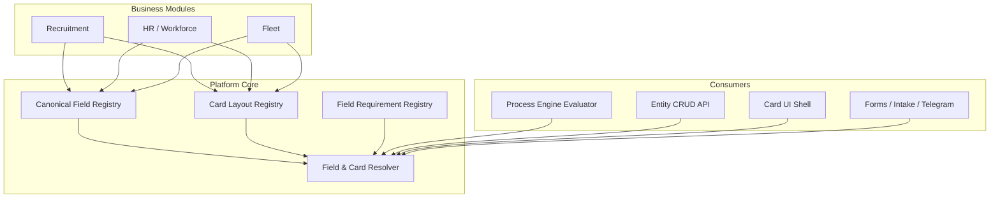

# Field Registry & Card Configuration — platform capability canon

**Status:** Accepted (architecture canon). **Implementation:** P0 canon accepted; **P1–P5 complete**; **Closure gate** (`test_field_registry_closure.py`). P6+ planned.  
**Hierarchy:** L2 operating canon — platform layer. Sibling to Process Engine and Document Hub.  
**Owner:** Architecture canon + platform core team.

**Runtime formula (target):**

```
Entity → Canonical Fields → Card Layout → Field Requirements → Module Usage
```

Process Engine is **CLOSED** (P0–P6). Field Registry is the **next foundational layer** — same canonization pattern: one Core mechanism, modules register and consume, no parallel per-module field matrices.

### P1 implementation status (2026-08-18)

| Deliverable | Status | Location |
|-------------|--------|----------|
| Registry ORM models | Done | `backend/app/models/field_registry.py` |
| Alembic migration | Done | `backend/alembic/versions/202608180001_field_registry_p1.py` |
| Module manifests | Done | `backend/app/field_registry/manifests/{platform,recruitment,crm}.py` |
| Registry upsert service | Done | `backend/app/field_registry/registry.py` |
| Read-only resolver | Done | `backend/app/field_registry/resolver.py` |
| Tenant seed | Done | `backend/app/field_registry/seed.py` → wired in `backend/app/seed.py` |
| Read API | Done | `GET /api/v1/platform/field-registry/{fields,layouts,effective-layout}` |
| Tests | Done | `backend/tests/field_registry/test_field_registry_p1.py` |

**Not changed in P1 (compat):** `CandidateProfile.config`, candidate card UI, `personal_data` / `extra` storage, Process Engine runtime, save/PATCH validation.

### P2 implementation status (2026-06-03)

| Deliverable | Status | Location |
|-------------|--------|----------|
| Frontend API client | Done | `hostflow-frontend/src/api/fieldRegistry.ts` |
| Layout utils + profile fallback | Done | `hostflow-frontend/src/utils/fieldLayoutUtils.ts`, `profileUtils.ts` |
| Candidate card hook | Done | `hostflow-frontend/src/hooks/useEffectiveCandidateLayout.ts` |
| Candidate card UI integration | Done | `CandidateCard.tsx` + section components |
| Vacancy/client read smoke | Done | `backend/tests/field_registry/test_field_registry_p2.py` |
| Tests (fallback + API layout) | Done | `hostflow-frontend/src/utils/__tests__/fieldLayoutUtils.test.ts` |

**P2 behaviour:** Candidate card loads `GET /api/v1/platform/field-registry/effective-layout?entity_type=candidate&layout_code=recruitment.candidate.default`. Section order/field visibility/labels/required hints come from registry when API succeeds; `profileUtils` + `CandidateProfile.config` remain fallback when API fails or field is not in layout. **Save/PATCH, `validateRequiredFields`, `personal_data`, `extra`, Process Engine field requirements unchanged.**

---

## Decision (canon)

**Field Registry & Card Configuration live in Platform Core.**

They are **not** a business module. They are **not** sold as a separate product line.  
They are a **shared platform capability** — same class as Process Engine, Document Hub, Auth, RBAC, Tenant.

Business modules **declare** which canonical fields they use, **register** card layouts and requirement bindings, and **consume** the unified resolver. They **must not** implement parallel field registries, ad-hoc card JSON blobs, or module-local required-field matrices.

**Module independence rule:**

| Wrong | Right |
|-------|-------|
| Recruitment defines `candidate.phone` semantics | Platform defines `recruitment.candidate.phone`; Recruitment consumes |
| HR card duplicates candidate PII layout | HR card references shared identity namespace + HR extensions |
| Vacancy stores free-form field list in JSON | Vacancy card layout references canonical vacancy fields |
| Process Engine hardcodes field names in Python | Process Engine `pe_field_requirements` reference registry codes |

Cross-module identity and handoff fields use **published canonical codes** and **contracts** — not duplicated keys in each module's config JSON.

---

## 1. Purpose

### 1.1 What this layer solves

HostFlow needs **one** mechanism for:

- defining **what a field means** (semantics, type, normalization, reference domain);
- defining **where it appears** on entity cards (sections, order, visibility);
- defining **when it is required** (save, transition, handoff, module hook);
- enforcing **who may read/write** a field (RBAC zone + lane policy);
- letting modules **extend** entities without forking card infrastructure.

Without this layer, each card reinvents field lists — as today with `CandidateProfile.config.field_configs`, scattered `personal_data` / `extra` keys, frontend `profileUtils.ts`, and tactical validators in API/services.

### 1.2 Card surfaces in scope (v1 target)

| Card | Primary entity | Owning module(s) | Notes |
|------|----------------|------------------|-------|
| **Candidate** | `candidate` | Recruitment (+ shared identity for handoff) | Richest legacy surface; `CandidateProfile` + custom fields |
| **Employee** | `workforce_employee` | HR / Workforce | Post-handoff operational profile |
| **Vacancy** | `vacancy` | Recruitment | Job requirements, routing, profile binding |
| **Client** | `company` (client role) | Recruitment / CRM | Client company card, not tenant workspace |
| **Vehicle** | `vehicle` | Fleet | Asset card |
| **Damage case** | `damage_case` | Fleet | Incident / claim card |

All cards share: **canonical field codes**, **layout sections**, **visibility/requirement resolution**, **evaluator hooks** for Process Engine.

Out of scope for v1 canon (later): Lead card polish, Invoice line items, full Forms Platform field matrix (ADR-007 remains sibling).

---

## 2. Architecture layers



| Layer | Responsibility | Must not |
|-------|----------------|----------|
| **Canonical Field Registry** | Stable field identifiers, types, storage binding, reference domains | UI section order, per-tenant labels only without code |
| **Card Layout Registry** | Sections, field order, default visibility, module card templates | Transition rules, document verification |
| **Field Requirement Registry** | Required / optional / hidden **rules** by context (save, transition, handoff) | Store entity values |
| **Field & Card Resolver** | Effective layout + requirements for `(tenant, company, entity, context)` | Module-specific business decisions outside registered hooks |
| **Module usage** | Bind layouts to process profiles, vacancies, roles | Define duplicate canonical codes |

**Relation to Process Engine (closed):**

- Process Engine **`pe_field_requirements`** rows reference **canonical field codes** from this registry — not free-text keys.
- Evaluator `blocking_reasons[].source_layer = field_requirements` aligns with [`process-engine.md`](process-engine.md) §9.3.
- Card visibility does **not** replace transition gates; both must pass where applicable.

**Relation to Document Hub (ADR-009):**

- Document-type **field schemas** (REF-4 `document_field_schemas`) remain in reference catalog.
- Entity card fields that **mirror** document extractable attributes link via `reference_domain` / `maps_to_document_field` — not duplicate semantics.

**Relation to REF-4 reference catalog:**

- `reference_field_schema_registry.py` covers **legal/workforce reference domains** (citizenship, permit_type, …).
- Field Registry **extends** that pattern to **entity card fields** (`recruitment.candidate.first_name`, …) with storage binding and card layout.

---

## 3. Canonical Field Registry

### 3.1 Qualified field code

Every canonical field has a **qualified code**:

```
{module}.{entity_type}.{field_code}
```

Examples:

| Qualified code | Meaning |
|----------------|---------|
| `recruitment.candidate.first_name` | Candidate given name |
| `recruitment.candidate.contacts.phone` | E.164-capable phone on candidate |
| `recruitment.vacancy.work_country` | Primary work country for vacancy |
| `hr.employee.employment_type` | Workforce employment type (reference code) |
| `fleet.vehicle.registration_number` | Vehicle registration |
| `platform.identity.birth_date` | Shared identity field (cross-module) |

**Rules:**

1. **`field_code`** is stable, lowercase, snake_case; nested paths use dot notation (`contacts.phone`).
2. **Platform namespace** (`platform.*`) holds cross-module identity and audit-safe shared fields.
3. **Module namespace** holds extensions; modules must not redefine `platform.*` semantics.
4. Deprecation uses `replaced_by` + sunset window — same discipline as REF-4 catalog entries.

### 3.2 Field definition record (canon shape)

Each registry row (future: `fr_canonical_fields` or platform seed manifest):

```yaml
qualified_code: recruitment.candidate.contacts.phone
entity_type: candidate
module: recruitment
field_code: contacts.phone
label_key: fields.recruitment.candidate.contacts.phone   # i18n key, not inline Cyrillic
field_type: phone_e164                                 # see §4
storage:
  kind: column | json_path | custom_field | computed
  path: phone                                          # or personal_data.contacts.phone
reference_domain: null                                 # or dial_country_codes, citizenships, …
normalization: phone_e164
pii_class: contact                                   # telemetry / export policy
ownership: recruitment                               # module that registered semantics
mutability:
  default: read_write
  zones: [recruitment, shared_identity, hr_workforce]  # see candidate-field-zones doc
deprecated: false
replaced_by: null
registry_version: field_registry_v1
```

Minimum required attributes (REF-4 aligned):

1. canonical field identifier (`qualified_code`);
2. entity type + module ownership;
3. field type + normalization;
4. storage binding (where value lives today and target);
5. PII / export class;
6. deprecation lineage.

### 3.3 Entity namespaces (v1)

| Namespace prefix | Entity types | Owner module | Storage today (legacy) |
|------------------|--------------|--------------|-------------------------|
| `platform.identity.*` | person-like shared | Platform Core | candidate columns + `personal_data` |
| `recruitment.candidate.*` | `candidate` | Recruitment | `candidates` table, `extra`, `custom_field_values` |
| `recruitment.vacancy.*` | `vacancy` | Recruitment | `vacancies` columns + JSON |
| `recruitment.lead.*` | `lead` | Recruitment / Leads | `leads` + intake mappings |
| `hr.employee.*` | `workforce_employee` | HR | workforce tables + operational profile |
| `fleet.vehicle.*` | `vehicle` | Fleet | fleet ORM |
| `fleet.damage_case.*` | `damage_case` | Fleet | fleet ORM |
| `crm.client.*` | `company` (client) | Recruitment / CRM | `companies` + module settings |

Modules **register** fields in their namespace. They **reference** `platform.identity.*` on cards instead of copying definitions.

---

## 4. Field types

Canonical types (extensible; validators live in Core):

| Type | Validation / normalization | Typical UI control |
|------|---------------------------|-------------------|
| `text` | trim, max length | single-line input |
| `textarea` | trim, max length | multiline |
| `phone_e164` | E.164 + country code companion | phone input + dial code |
| `email` | RFC5322 subset | email input |
| `date` | ISO date, timezone-safe | date picker |
| `datetime` | ISO instant | datetime picker |
| `boolean` | strict bool | checkbox |
| `integer` | int bounds | number input |
| `decimal` | decimal precision | number input |
| `code` | slug / identifier | select / autocomplete |
| `code_alpha2` | ISO 3166-1 alpha-2 | country select |
| `reference_code` | must exist in named reference domain | catalog-backed select |
| `reference_code[]` | list of reference codes | multiselect |
| `json_object` | schema-validated blob | structured sub-form |
| `computed` | read-only derived | display only |
| `custom_field` | indirection via `CustomFieldDefinition` | tenant-defined control |

**Reference-backed fields** must declare `reference_domain` (ties to REF-4 facade / `reference_field_schema_registry.py`).

**Arrays** use `[]` suffix on `field_code` (legacy: `experience.trailer_types[]`).

---

## 5. Required / optional / hidden logic

Three orthogonal axes — do not conflate:

| Axis | Question | Source |
|------|----------|--------|
| **Visibility** | Is the field shown on the card? | Card Layout + role + lane |
| **Editability** | May the actor PATCH it? | RBAC zone + handoff lane (e.g. HR internal lane) |
| **Requirement** | Must it be populated for this action? | Field Requirement Registry + context |

### 5.1 Requirement contexts

| Context | When evaluated | Example |
|---------|----------------|---------|
| `card_save` | PATCH entity / section save | Vacancy title required on save |
| `transition` | Process Engine stage change | Phone required before `ready_for_handoff` |
| `handoff` | Handoff create / accept | Address required for HR intake |
| `intake` | Public form / Telegram / Meta | Email required on lead capture |
| `module_hook` | Registered module evaluator | Recruitment package completeness |

Requirement levels:

| Level | Behavior |
|-------|----------|
| `required` | Block action; `blocking_reasons` entry |
| `optional` | Warn only (soft) or ignore |
| `hidden` | Field not in effective layout for context |
| `read_only` | Visible but not PATCHable |

**Precedence (effective requirement):**

1. Platform immutable rules (legal / PII policy)
2. Process profile + `pe_field_requirements` (Process Engine)
3. Card layout profile (vacancy / candidate profile / company module settings)
4. Tenant override (bounded — labels, optional toggles where allowed)
5. Legacy shim (during migration only)

### 5.2 Hidden vs not required

- **Hidden** — resolver omits field from layout DTO; UI does not render.
- **Not required** — field may be empty; action still allowed.
- A field can be **visible + optional** or **hidden + required** (rare: validated server-side only, e.g. system-populated).

---

## 6. Module ownership

| Concern | Owner |
|---------|-------|
| Canonical semantics of module fields | Registering business module |
| `platform.identity.*` semantics | Platform Core |
| Card layout templates (defaults) | Registering module |
| Effective layout for tenant/company | Resolver + bounded tenant/company overrides |
| Transition/handoff requirements | Process Engine registry rows referencing field codes |
| PATCH allowlists (HR lane, client tenant) | Platform policy hooks consuming registry zones |
| Custom tenant fields | Tenant via `CustomFieldDefinition` — must map to `custom_field` type in registry |

Modules **must not**:

- add new canonical codes in another module's namespace;
- embed required-field lists in Python constants for transition gates (use registry);
- hardcode card section structure in frontend only (layout must be API-resolvable).

---

## 7. Card Layout Registry

### 7.1 Layout profile

A **card layout profile** binds to:

- `entity_type`
- optional `module` + `profile_code` (e.g. `recruitment_default`, `driver_ce`, `vacancy_standard`)
- optional linkage to **Process Profile** (`pe_process_profile_id`) for recruitment cards

```yaml
layout_profile:
  code: recruitment.candidate.driver_ce
  entity_type: candidate
  module: recruitment
  process_profile_code: recruitment_default   # optional PE link
  sections:
    - code: basic
      label_key: card.candidate.sections.basic
      order: 10
      fields:
        - qualified_code: recruitment.candidate.first_name
          order: 10
          visible: true
          required: true
        - qualified_code: recruitment.candidate.contacts.phone
          order: 20
          visible: true
          required: false
    - code: experience
      order: 30
      collapsible: true
      fields: [...]
  custom_field_slots:
    - section: custom_fields
      allow_tenant_definitions: true
```

### 7.2 Standard sections (convention)

| Section code | Typical content |
|--------------|-----------------|
| `basic` / `identity` | Name, contacts |
| `personal` | Birth date, citizenship, location |
| `experience` | Qualifications, routes, employments |
| `documents` | Document Hub summary (not raw storage) |
| `operations` | Stage, assignee, tags, reminders |
| `agreements` | Legal consents |
| `custom_fields` | Tenant `CustomFieldDefinition` slots |
| `module_extensions` | Module-specific blocks (HR, Fleet) |

Frontend **Card Shell** (ADR-010 / ADR-011) renders sections from resolver DTO — not hardcoded per-module JSX field lists (migration gradual).

### 7.3 Resolution chain (target runtime)

```
Entity instance
  → effective card layout profile (vacancy / process profile / tenant default)
  → Card Layout Registry rows
  → Canonical Field Registry metadata
  → EffectiveCardLayout DTO (sections, fields, labels, visibility, requirement hints)
```

Legacy today:

```
Vacancy.candidate_profile_id → CandidateProfile.config.field_configs → profileUtils.ts
```

Target:

```
Vacancy.pe_process_profile_id → Card Layout profile → Field Registry
(with CandidateProfile.config bridge during migration)
```

---

## 8. Field visibility

Effective visibility function:

```
visible(field, actor, entity, context) =
  layout.visible
  AND NOT hidden_by_requirement_context
  AND role_may_read(field.zones, actor.role)
  AND NOT masked_by_privacy_policy(field.pii_class)
  AND module_installed(field.module)
```

Special cases (existing product rules — must map to registry zones):

| Policy | Canon mapping |
|--------|---------------|
| HR internal lane read-only PII | `shared_identity` zone → `read_only` for `hr_officer` |
| Client tenant stage visibility | `operations.stage` visibility flag per tenant type |
| Masked candidate (billing / privacy) | resolver returns layout with PII fields omitted |
| Default profile empty config = show all | **Legacy shim** — default layout profile lists all registered fields |

---

## 9. Field requirements for Process Engine

Process Engine already has **`pe_field_requirements`** (P1 schema). Activation migration will:

1. Replace free-text `field_code` entries in manifest config with **qualified registry codes**.
2. Evaluate via **Field Registry resolver** inside `TransitionEvaluatorAdapter` / transfer readiness.
3. Emit `blocking_reasons` with `source_layer: field_requirements`.

Example (target shape):

```yaml
# pe_field_requirements.config
requirement_kind: canonical_fields
context: transition
system_stage: ready_for_handoff
fields:
  - qualified_code: recruitment.candidate.contacts.phone
    level: required
  - qualified_code: platform.identity.address
    level: required
  - qualified_code: recruitment.candidate.contacts.email
    level: optional
resolver: field_registry.populated_check_v1
```

**Integration points:**

| Consumer | Uses field requirements for |
|----------|----------------------------|
| `TransitionEvaluatorAdapter.evaluate_transition` | Stage transition blocking |
| `TransferPolicyResolver` (compat) | Handoff readiness — migrate to registry |
| `recruitment_package_readiness` | Dossier / contact completeness |
| Intake / Telegram / Meta | `context: intake` rules |
| Forms Platform (ADR-007) | Question → `qualified_code` binding |

**Not in Field Registry:** document presence/verification (Document Hub + `pe_document_requirements`).

---

## 10. Migration map (current → target)

**Strategy:** strangler fig — same as Process Engine. Introduce registry + resolver; shim legacy paths; guard new direct blob access.

### 10.1 Summary table

| Legacy artifact | Location | Role today | Target |
|-----------------|----------|------------|--------|
| **`CandidateProfile.config`** | `candidate_profile.py`, API | `field_configs`, `document_configs`, gates fragments | **Card Layout profile** + PE registries; bridge via `pe_process_profile_id` |
| **`candidate_profiles` API field matrix** | `candidate_profiles.py` | `_DEFAULT_CANONICAL_FIELDS`, `_FIELD_PURPOSES`, section order | Seed **Canonical Field Registry** + default layout |
| **`profileUtils.ts`** | frontend | visible/required/label from profile JSON | Consume **EffectiveCardLayout** API |
| **`CandidateCard.tsx` sections** | frontend | Hardcoded section components | Card Shell + layout-driven field list |
| **`personal_data` / `extra` JSON** | `candidates` table | Schemaless storage | `storage.json_path` on canonical fields |
| **`CustomFieldDefinition`** | `custom_field.py` | Tenant extensions | `field_type: custom_field` + layout slot |
| **`reference_field_schema_registry.py`** | REF-4 Phase 1C | Legal/workforce reference field schemas | Subset of registry; entity fields extend same model |
| **`pe_field_requirements`** | Process Engine P1 | Manifest seed, not fully wired | Reference qualified codes; evaluator activation |
| **`recruitment_package_readiness`** | services | Tactical contact field checks | `field_requirements` + module hook |
| **`candidate-field-zones-hr-internal-lane.md`** | architecture | PATCH allowlists | `mutability.zones` on canonical fields |
| **Vacancy fields** | vacancies ORM + forms | Module-local | `recruitment.vacancy.*` registry |
| **Workforce employee card** | HR frontend/services | Module-local | `hr.employee.*` registry + layout |
| **Fleet vehicle / damage** | Fleet module | Module-local | `fleet.*` registry + layout |

### 10.2 Candidate field migration (detailed)

Current canonical list (API seed — to become registry rows):

| Legacy key | Target qualified code | Storage today |
|------------|----------------------|---------------|
| `first_name` | `recruitment.candidate.first_name` | column |
| `last_name` | `recruitment.candidate.last_name` | column |
| `contacts.phone` | `recruitment.candidate.contacts.phone` | column + `contacts` JSON |
| `contacts.email` | `recruitment.candidate.contacts.email` | column |
| `personal.birth_date` | `platform.identity.birth_date` | `personal_data` |
| `personal.citizenship` | `platform.identity.citizenship` | `personal_data` + reference |
| `experience.years_ce` | `recruitment.candidate.experience.years_ce` | `extra` / experience JSON |
| `stage` | `recruitment.candidate.operations.stage` | column |
| `assignee` | `recruitment.candidate.operations.assignee` | column / relations |

`CandidateProfile.config.field_configs[]` maps 1:1 to **layout profile field rows** (visible, required, order, label override).

### 10.3 Vacancy / employee / fleet (v1 migration notes)

| Entity | Legacy | Target layout owner |
|--------|--------|---------------------|
| Vacancy | Form fields in vacancy API + UI | `recruitment.vacancy.default` layout profile |
| Employee | Workforce operational profile, ZUS workspace | `hr.employee.default` + process-specific layouts |
| Client company | Company module settings | `crm.client.default` |
| Vehicle | Fleet asset form | `fleet.vehicle.default` |
| Damage case | Fleet incident form | `fleet.damage_case.default` |

Detailed field inventories are **implementation deliverables** (P1 registry seed), not this canon.

### 10.4 Phased migration (recommended)

| Phase | Deliverable | Legacy shim | Status |
|-------|-------------|-------------|--------|
| **P0 — Canon** | This document + cross-links | None | **Done** |
| **P1 — Registry schema** | DB/API for canonical fields + card layouts (read) | `CandidateProfile.config` unchanged at runtime | **Done** |
| **P2 — Resolver facade** | Card UI consumes effective layout API | Frontend still uses profileUtils fallback | **Done** |
| **P3 — Candidate card** | Effective layout API for candidate | `CandidateProfile` bridge | **Done** |
| **P4 — Process Engine link** | `pe_field_requirements` → registry codes | TransferPolicyResolver tactical checks | **Done** |
| **P5 — Vacancy + intake** | Vacancy layout + intake field binding | Vacancy forms unchanged at API contract | **Done** |
| **P6 — HR / Fleet cards** | Employee, vehicle, damage layouts | Module-local forms | Planned |
| **Closure gate** | Idempotent seed, guards, regression | Deprecate direct `field_configs` writes | **Done** |

---

## 11. API & UI compatibility (target)

Until clients migrate:

- `GET /api/v1/candidate-profiles/:id` — remains; backed by layout registry sync (dual-write during migration).
- Candidate card frontend — continues reading profile; switches to `GET /api/v1/cards/effective?entity=candidate&id=…` when available.
- Transfer readiness / package readiness — continue; field blocking migrates to registry-backed evaluator.

New canonical (TBD in implementation ADR):

- `GET /api/v1/platform/field-registry` — read canonical definitions (admin / manifest sync)
- `GET /api/v1/cards/effective-layout` — resolved layout + requirements for entity + context

---

## 12. Guards & closure criteria

Mirror Process Engine closure (`backend/tests/field_registry/test_field_registry_closure.py`):

| Check | Goal |
|-------|------|
| Seed idempotent | Repeated tenant seed does not duplicate fields/layouts |
| Existing tenant upgrade | New/existing tenant receives baseline fields + default layouts |
| CandidateProfile bridge | Overlay merges `field_configs`; empty `driver_ce_default` config preserves registry |
| Candidate card fallback | Frontend `profileUtils` used when effective layout API unavailable |
| Field requirements | PE manifest `field_requirements` use qualified codes only |
| Transfer blockers | Handoff contact gaps emit `source_layer: field_requirements` |
| Guard | No new hardcoded `missing.append({"field_code": "phone"…})` handoff checks outside allowlist |

**Allowlist (legacy shims only):**

- `recruitment_package_readiness._missing_contact_fields_legacy` — unit-test shim; runtime uses registry evaluator
- `candidate_layout_bridge` — `CandidateProfile.config` overlay (not a second source of truth)

**Not in closure (deferred to P6+):**

- Deprecate direct `CandidateProfile.config.field_configs` writes outside layout editor + bridge
- HR / Fleet card layouts

---

## 13. Related documents

**Must stay consistent:**

- [`process-engine.md`](process-engine.md) — Process Engine **CLOSED**; §9 Field Registry relation; `pe_field_requirements`
- [`platform-architecture-principles.md`](../architecture/platform-architecture-principles.md) — Core vs module
- [`hostflow-core-domain-map-v1.md`](../architecture/hostflow-core-domain-map-v1.md) — entity ownership
- [`candidate-field-zones-hr-internal-lane.md`](../architecture/candidate-field-zones-hr-internal-lane.md) — mutability zones
- [`transfer-policy.md`](../workflows/transfer-policy.md) — tactical field blocking ( migrates to registry)
- [`ref4_core_catalog_completion_gate_plan.md`](../gates/ref4_core_catalog_completion_gate_plan.md) — reference field schema discipline
- [`ADR-007`](../architecture/ADR-007-forms-platform-capability.md) — Forms Platform (intake questions → canonical fields)
- [`ADR-009`](../architecture/ADR-009-document-hub-platform-layer.md) — Document Hub (not card field storage)
- [`ADR-010`](../architecture/ADR-010-unified-resource-list-shell.md), [`ADR-011`](../architecture/ADR-011-hostflow-ui-platform-standard.md) — UI shells

**Code anchors (legacy / partial):**

- `backend/app/reference/reference_field_schema_registry.py` — REF-4 reference field schemas
- `backend/app/api/v1/candidate_profiles.py` — canonical field list + purposes (migration source)
- `backend/app/models/candidate_profile.py` — layout blob today
- `hostflow-frontend/src/utils/profileUtils.ts` — client-side layout resolution today
- `backend/app/process_engine/manifests/recruitment.py` — `field_requirements` seed

---

## 14. Implementation notes for agents

When changing card fields, visibility, or transition required-data behaviour:

1. Read **this document** (strategy) and **process-engine.md** (transition/handoff contexts).
2. Do **not** add new field semantics only in frontend or `CandidateProfile.config` without registry entry.
3. Prefer **qualified codes** in new rules, manifests, and tests.
4. Keep modules independent — shared identity lives in `platform.identity.*`.
5. Document Hub owns documents; Field Registry owns **entity attributes** and **card presentation**.

| Phase | Status |
|-------|--------|
| **P1 — Registry schema** | **Done** — `fr_canonical_fields`, `fr_card_layout_profiles`, `fr_card_layout_fields`; seed baseline candidate/vacancy/client fields; read API |
| **P2 — Card UI reads layout** | **Done** — candidate card effective-layout + profileUtils fallback; save/runtime unchanged |
| **P3 — CandidateProfile bridge** | **Done** — candidate/profile-bound effective layout + config overlay |
| **P4 — Process Engine link** | **Done** — `pe_field_requirements` qualified codes + transfer policy evaluator |
| **Closure gate** | **Done** — `test_field_registry_closure.py` |
| **P5 — Vacancy + intake** | **Done** — vacancy effective layout on card; Meta intake `qualified_field_code` bridge |
| **P6 — HR / Fleet layouts** | **Done** — baseline `hr.employee.*` and `fleet.vehicle.*` fields + default layouts |

### P5 migration notes (2026-06-03)

| Change | Detail |
|--------|--------|
| Vacancy card | `useEffectiveVacancyLayout` + `vacancyLayoutUtils` drive field order/visibility/labels |
| Intake mapping | `qualified_field_code` on Meta rules; `intake_mapping.py` resolves to legacy normalized paths |
| Compatibility | `enrich_mapping_rule_for_storage` keeps legacy `target` populated; old rules still work |
| Not in P5 | Drag/drop layout editor, HR/Fleet, mapping deletion, validation UI marketplace |

**After P6:** damage case layout remains deferred until Fleet damage runtime is in scope.

### P6 migration notes (2026-06-05)

| Change | Detail |
|--------|--------|
| HR baseline | `hr.employee.*` canonical fields for employee identity, employment, assignment, and notes |
| HR layout | `hr.employee.default` default card layout |
| Fleet baseline | `fleet.vehicle.*` canonical fields for vehicle identity, technical data, operations, and notes |
| Fleet layout | `fleet.vehicle.default` default card layout |
| Seed behavior | Tenant seed is upgrade-friendly; existing tenants receive HR/Fleet artifacts without duplicate rows |
| API | Existing `effective-layout` resolver returns HR/Fleet layouts by entity type and layout code |
| Not in P6 | HR workflow, employee dossier runtime, fleet runtime, damage runtime, layout editor, validation UI |

### Closure gate v2 (2026-06-05)

| Deliverable | Status | Location |
|-------------|--------|----------|
| Single Alembic head | Done | `test_closure_alembic_single_head` |
| Idempotent seed guard | Done | `test_closure_seed_idempotent_registry_counts` |
| Existing tenant upgrade baseline | Done | `test_closure_existing_tenant_upgrade_receives_baseline_artifacts` |
| Effective layouts candidate/vacancy/client/HR/Fleet | Done | `test_closure_existing_tenant_upgrade_receives_baseline_artifacts` |
| CandidateProfile bridge | Done | `test_closure_candidate_profile_bridge_*` |
| Intake canonical mapping | Done | `test_closure_intake_mapping_uses_canonical_qualified_codes_with_legacy_compatibility` |
| Frontend fallback regression | Done | `fieldLayoutUtils.test.ts` |
| PE qualified codes only | Done | `test_closure_pe_field_requirements_manifest_uses_qualified_codes_only` |
| Transfer policy wiring | Done | `test_closure_transfer_policy_uses_field_requirement_evaluator` |
| Hardcoded contact guard | Done | `test_closure_no_hardcoded_handoff_contact_missing_checks_outside_allowlist` |
| Regression modules | Done | P1–P4 + transfer policy + frontend layout tests |

**After closure:** P5 vacancy + intake layout binding — **done** (see P5 migration notes).

### P3 migration notes (2026-06-03)

| Change | Detail |
|--------|--------|
| Bridge resolver | `resolve_effective_candidate_card_layout()` — vacancy/profile/process profile → layout |
| Profile overlay | `CandidateProfile.config.field_configs` merges onto registry layout rows |
| API | `GET .../effective-layout?candidate_id=&candidate_profile_id=` |
| Frontend | `useEffectiveCandidateLayout({ candidateId, candidateProfileId })` |
| Not in P3 | Save/PATCH migration, `CandidateProfile` removal, card_save validation from registry |

### P4 migration notes (2026-06-03)

| Change | Detail |
|--------|--------|
| PE manifest | `recruitment_contact_core` uses `qualified_code` + `level: required` |
| Evaluator | `evaluate_field_requirements_for_candidate()` — registry storage populated checks |
| Transfer policy | `source_layer: field_requirements` blocking reasons |
| Recruitment package | Contacts block uses same evaluator (legacy `_missing_contact_fields` kept for unit tests) |
| Not in P4 | Full `validateRequiredFields` migration, intake binding, HR/Fleet cards |

**P0 complete when:** this canon is accepted and linked from Process Engine closure notes. **P1 complete:** registry tables + seed + read API + tests; runtime save unchanged. **P2 complete:** candidate card reads effective layout with fallback; tests green. **P3 complete:** CandidateProfile bridge on effective layout. **P4 complete:** Process Engine field requirements wired to registry.

### P1 migration notes (2026-08-18)

| Change | Detail |
|--------|--------|
| Tables | `fr_canonical_fields`, `fr_card_layout_profiles`, `fr_card_layout_fields` |
| Manifests | Platform identity + recruitment candidate/vacancy + CRM client baseline |
| Seed | `ensure_platform_field_registry_catalog()` + `ensure_tenant_field_registry_defaults()` |
| Read API | `/api/v1/platform/field-registry/fields`, `/layouts/{code}`, `/effective-layout` |
| Resolver | `resolve_effective_card_layout()` — read-only; no save/runtime wiring |
| Not in P1 | Candidate card UI, PATCH validation, `CandidateProfile` removal, Process Engine field requirement activation |

### P2 migration notes (2026-06-03)

| Change | Detail |
|--------|--------|
| Frontend API | `getEffectiveCardLayout()` → `/platform/field-registry/effective-layout` |
| Candidate card | `useEffectiveCandidateLayout` + section order from registry |
| Fallback | API error / missing layout → existing `profileUtils` + `CandidateProfile.config` |
| Not in P2 | Save/PATCH, `validateRequiredFields`, vacancy/client card UI wiring, Process Engine field requirement activation |
