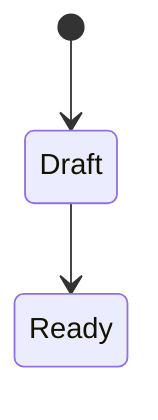

# Entity Specification: <EntityName>

**Status:** draft | active | deprecated  
**Version:** 1.0.0  
**Date:** YYYY-MM-DD  
**Class:** Business Entity | Support Entity | Infrastructure  
**Owner Domain:**  
**Related ADR:** ADR-NNN

> Каждая **Business Entity** описывается по этому шаблону **до** создания таблиц и публичных API.  
> Расположение: `docs/specs/entities/<entity-slug>.md`

---

## 1. Название

| | |
|---|---|
| **Модель (код / API)** | `<PascalCase>` e.g. `Search` |
| **Slug** | `search` |
| **Пользовательское название (UI)** | e.g. «Подбор» |
| **Множественное (UI)** | e.g. «Подборы» |

**Human Language First:** UI **не обязан** использовать имя модели.

---

## 2. Назначение

*(Что это в предметной области бизнеса; 3–5 предложений. Пройти Entity Independence: имеет смысл без UI?)*

**Entity Independence:** да / нет — если нет → скорее Support Entity.

---

## 3. Owner Domain

| | |
|---|---|
| **Owner** | |
| **Domain Contract** | [`docs/specs/domains/<domain>.md`](../domains/) |

---

## 4. Identity (immutable после создания)

| Field | Type | Required | Notes |
|-------|------|----------|-------|
| `<entity>_id` | UUID | yes | |
| `created_at` | timestamp | yes | business time: момент появления в системе |
| | | | e.g. source, origin_company_id |

**Правило:** Life Cycle **не меняет** Identity.

---

## 5. State (mutable)

| Field | Type | Required | Notes |
|-------|------|----------|-------|
| `current_stage` / `status` | enum | yes | canonical state |
| | | | |

**Производные flags** *(views, не SSOT):*  

---

## 6. Life Cycle

**States:**

```
<state_1> → <state_2> → …
```

**Initial state:**  

**Terminal states:**  

**Diagram** *(optional):*



---

## 7. Допустимые Transitions

| From | To | Command / trigger | Preconditions | Side effects |
|------|-----|-------------------|---------------|--------------|
| | | | | |

**Explicitly forbidden:**

| From | To | Why |
|------|-----|-----|
| | | |

---

## 8. History

**Model:** append-only transition log  

| Record | Fields |
|--------|--------|
| Transition event | `from_state`, `to_state`, `at`, `actor`, `reason`, `metadata` |

**Retention / audit:**  

**Пример цепочки:**

```
Applied → Phone Screen → Interview → Offer → Rejected
```

---

## 9. Canonical State

| | |
|---|---|
| **SSOT location** | Owner Domain service / table |
| **Single field(s)** | e.g. `status` + `current_stage` mapping |
| **Readers** | workspaces, analytics, other domains (read-only) |

**Anti-patterns to avoid:**

- Parallel status in UI-only store  
- Legacy flag without mapping to canonical state  

---

## 10. Business Time

| Timestamp | Meaning | Set on transition |
|-----------|---------|-------------------|
| `created_at` | | creation |
| | | e.g. `activated_at` → Active |

---

## 11. Domain Contract (entity slice)

**Read API** *(what others may rely on):*

-  

**Commands** *(owner only):*

-  

**Events published:**

| Event | When |
|-------|------|
| | |

**Handoff** *(if applicable):*

| To domain | Event | Snapshot |
|-------------|-------|----------|
| | | |

---

## 12. Workspaces

| Domain Workspace | As Command | As View | Record Workspace |
|------------------|------------|---------|------------------|
| e.g. Recruitment | Создать подбор | Активные подборы | Search card |

**Не создавать** отдельный Domain Workspace на entity.

---

## 13. Start / Optimize / Scale

| Phase | Role of this entity |
|-------|---------------------|
| **Start** | *(минимальный путь к первому результату)* |
| **Optimize** | |
| **Scale** | |

---

## 14. Evolution notes

**Заменяет / расширяет:** e.g. Search extends Vacancy  

**Не дублировать:**  

---

## 15. Open questions

- [ ]  

---

## Compliance checklist

- [ ] Owner Domain ровно один  
- [ ] Identity vs State разделены  
- [ ] Transitions explicit; нет произвольного set status  
- [ ] History first-class  
- [ ] Business time зафиксировано  
- [ ] Human language для UI указан  
- [ ] ADR ссылка (если Domain / Life Cycle change)  

---

## Связанные документы

- [`hostflow-constitution.md`](../hostflow-constitution.md)  
- [`architecture-decision-framework.md`](../architecture-decision-framework.md)  
- Domain Contract:  
- ADR:  
