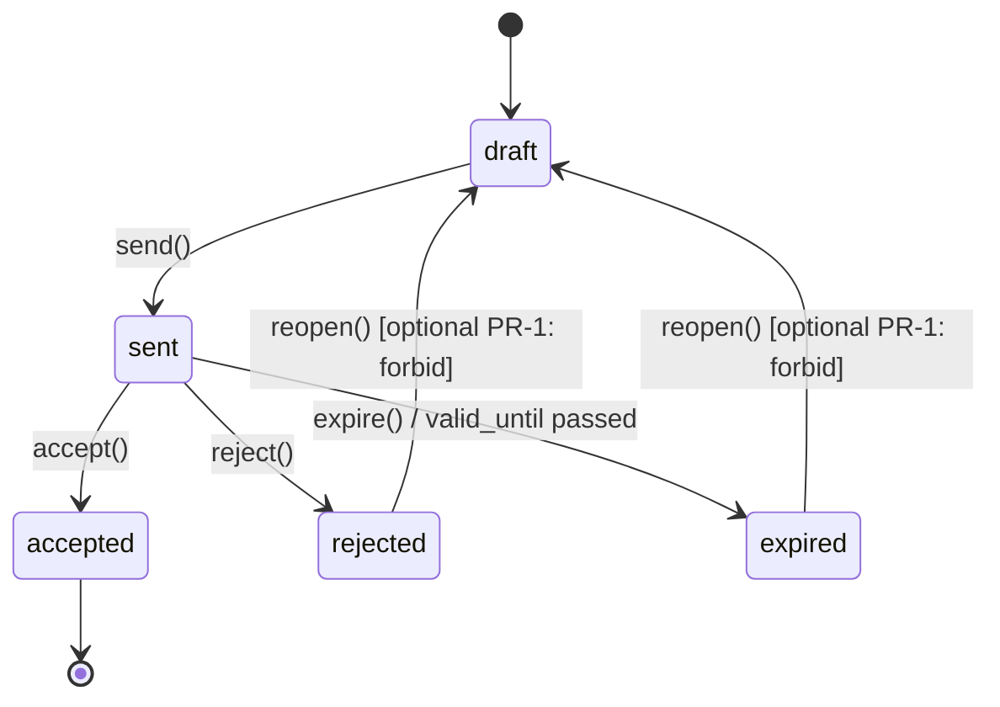

# Stage 1B — Quote Foundation Implementation Contract

**Status:** design-first (L3 implementation contract — **no runtime code until merge gate**)  
**Owner:** Services / Sales backend  
**Parent ADR:** [`ADR-020`](../architecture/ADR-020-sales-to-engagement-commercial-model.md)  
**Prerequisite:** Stage 1A merged (ClientAccount), auto-seed merged (services intake)  
**Scope:** Quote persistence + lifecycle + ClientAccount link + `scope_snapshot`. **No** Service Order, Commercial Confirmation, Invoice, Billing.

---

## 1. Goal

Learn to **create and store a commercial proposal** as a first-class domain object after identity (Stage 1A) and intake (auto-seed) are stable.

After Stage 1B PR-1, a manager can:

1. Create a **Quote** for a `ClientAccount`.
2. Maintain **versioned** commercial terms (`QuoteVersion`).
3. Move lifecycle: `draft → sent → accepted | rejected | expired`.
4. Freeze commercial scope in **`scope_snapshot`** at send/accept boundaries.
5. Read/update via tenant-scoped backend CRUD.

**Out of scope (explicit):**

- Service Order creation or Quote → SO transition
- Commercial Confirmation registry
- Invoice / Billing Event / Finance hooks
- Readiness engine / Engagement activation
- Frontend product UI (wireflow only in this phase)
- Questionnaire / form infrastructure changes

---

## 2. Vertical isolation rule

| Layer | Stage | Status after merge #19 |
|-------|-------|------------------------|
| Identity | 1A ClientAccount | ✅ merged |
| Intake | auto-seed targeted-advertising | ✅ merged |
| **Commercial proposal** | **1B Quote Foundation** | 🎯 next PR |
| Order | 1B+ Quote → Service Order | later PR |
| Commerce | Commercial Confirmation | later PR |
| Billing | Invoice / Billing Event | later PR |

Do **not** mix provisioning, forms, Quote, and Service Order in one PR.

---

## 3. Object model (summary)

Full detail: [`stage-1b-quote-object-model.md`](../architecture/stage-1b-quote-object-model.md).

### 3.1 `quotes`

| Field | Type | Notes |
|-------|------|-------|
| `id` | UUID | PK |
| `tenant_id` | UUID | RLS |
| `client_account_id` | UUID | **Required** FK → `client_accounts` |
| `own_company_id` | UUID, nullable | Operating company scope (from account/lead) |
| `quote_number` | string | Human-readable; unique per `(tenant_id, quote_number)` |
| `title` | string | Product label |
| `status` | enum | `draft` \| `sent` \| `accepted` \| `rejected` \| `expired` |
| `currency` | string(3) | ISO 4217, default tenant currency |
| `current_version_id` | UUID, nullable | Pointer to latest material version |
| `source_lead_id` | UUID, nullable | Traceability to Sales Inquiry transport |
| `valid_until` | date, nullable | Drives `expired` transition |
| `sent_at` | timestamptz, nullable | Set on `draft → sent` |
| `accepted_at` | timestamptz, nullable | Set on `sent → accepted` |
| `rejected_at` | timestamptz, nullable | Set on `sent → rejected` |
| `expired_at` | timestamptz, nullable | Set on expiry job or manual expire |
| `created_by_user_id` | UUID, nullable | Audit |
| `created_at` / `updated_at` | timestamptz | |

### 3.2 `quote_versions`

Immutable commercial revision rows (append-only after `sent`).

| Field | Type | Notes |
|-------|------|-------|
| `id` | UUID | PK |
| `tenant_id` | UUID | RLS |
| `quote_id` | UUID | FK → `quotes` |
| `version_number` | int | Monotonic per quote; starts at 1 |
| `status` | enum | Mirrors parent at creation time |
| `scope_snapshot` | JSONB | Frozen commercial scope (see §4) |
| `line_items` | JSONB | Structured commercial lines (MVP array) |
| `subtotal` / `tax_total` / `total` | numeric | Denormalized totals for list views |
| `notes_internal` | text, nullable | Not client-visible |
| `notes_client` | text, nullable | Shown on send |
| `created_by_user_id` | UUID, nullable | |
| `created_at` | timestamptz | |

**Rule:** editing commercial terms after `sent` creates a **new version** in `draft` on the quote (quote returns to `draft`) OR is forbidden in PR-1 — **PR-1 chooses: forbid mutation after `sent`; only status transitions on frozen version.**

---

## 4. `scope_snapshot` contract

JSON document capturing **what** is being sold at a lifecycle boundary.

```json
{
  "schema_version": 1,
  "service_family": "targeted_advertising",
  "offering_code": "meta_lead_gen_monthly",
  "parameters": {
    "channels": ["meta_ads"],
    "markets": ["PL"],
    "budget_range_pln": {"min": 3000, "max": 8000}
  },
  "client_account": {
    "id": "…",
    "display_name": "…"
  },
  "primary_company_id": "…",
  "captured_at": "2026-07-14T12:00:00Z"
}
```

**When captured:**

| Transition | Snapshot action |
|------------|-----------------|
| `draft` edits | Live fields on current draft version only |
| `draft → sent` | Freeze `scope_snapshot` on current version; immutable thereafter |
| `sent → accepted` | Copy reference only; no rewrite of sent snapshot |
| `sent → rejected` | No snapshot change |
| `sent → expired` | No snapshot change |

PR-1 validates `schema_version` and required keys; does not implement offering catalog.

---

## 5. Lifecycle state machine



| Status | Meaning | Allowed mutations |
|--------|---------|-------------------|
| `draft` | Composing proposal | CRUD version fields |
| `sent` | Delivered to client | Status transitions only |
| `accepted` | Client agreed (Sale layer) | Read-only |
| `rejected` | Client declined | Read-only |
| `expired` | Validity ended | Read-only |

**Invariant:** `accepted` does **not** create Service Order (next PR).

---

## 6. API contract (summary)

Full detail: [`stage-1b-quote-api-contract.md`](../api/stage-1b-quote-api-contract.md).

Prefix: `/api/v1/quotes`

| Method | Path | Purpose |
|--------|------|---------|
| GET | `/` | List (filter: status, client_account_id) |
| POST | `/` | Create draft quote + v1 |
| GET | `/{id}` | Detail + current version |
| PATCH | `/{id}` | Update draft metadata only |
| POST | `/{id}/versions` | New draft version (only while quote.status=draft) |
| POST | `/{id}/send` | `draft → sent`, freeze snapshot |
| POST | `/{id}/accept` | `sent → accepted` |
| POST | `/{id}/reject` | `sent → rejected` |
| POST | `/{id}/expire` | `sent → expired` (manual; job later) |
| GET | `/{id}/versions` | Version history |
| GET | `/{id}/versions/{version_id}` | Version detail |

RBAC: `viewer` read; `manager` / `supervisor` / `admin` write + transitions.

---

## 7. UI wireflow (design only)

Full detail: [`stage-1b-quote-ui-wireflow.md`](../ux/stage-1b-quote-ui-wireflow.md).

PR-1 ships **no frontend**. Wireflow defines Stage 1B-UI follow-up.

---

## 8. Sequences

Full detail: [`stage-1b-quote-lifecycle-sequences.md`](../workflows/stage-1b-quote-lifecycle-sequences.md).

---

## 9. Planned migrations (list only — no Alembic in design branch)

| Revision | Purpose |
|----------|---------|
| `202607141600_quote_foundation` | `quotes`, `quote_versions` tables, indexes, FKs |
| `202607141601_quote_status_check` | DB check constraints on status enum + version_number uniqueness |

**Indexes:**

- `UNIQUE (tenant_id, quote_number)`
- `UNIQUE (quote_id, version_number)`
- `(tenant_id, client_account_id, status)`
- `(tenant_id, status, updated_at DESC)`

**FK rules:**

- `quotes.client_account_id` → `client_accounts.id` (no cascade delete)
- `quote_versions.quote_id` → `quotes.id` (restrict delete)

---

## 10. PR-1 deliverables (first implementation PR)

| Include | Exclude |
|---------|---------|
| Alembic migrations §9 | Service Order tables/API |
| SQLAlchemy models | Commercial Confirmation |
| Repository + service layer | Invoice / billing hooks |
| `/api/v1/quotes` CRUD + transitions | Frontend pages |
| RBAC + tenant guards | Questionnaire changes |
| Unit + API tests (lifecycle matrix) | General provisioning engine |

---

## 11. Required tests (implementation PR)

| Scenario | Expected |
|----------|----------|
| Create draft for ClientAccount | Quote + version 1 in `draft` |
| Update draft line items | Mutates current draft version |
| Send quote | `sent`, snapshot frozen, `sent_at` set |
| Accept sent quote | `accepted`, `accepted_at` set; no SO row |
| Reject sent quote | `rejected` |
| Expire sent quote | `expired` |
| Cross-tenant read | 404 / forbidden |
| Delete ClientAccount | Quote preserved (no cascade) |
| Invalid transition (accept draft) | 409 conflict |
| Replay send on sent | Idempotent or 409 |

---

## 12. Merge gate (before starting implementation)

- [x] PR #18 cleanup merged
- [x] PR #19 auto-seed merged
- [x] Post-merge smoke: services tenant provisioning tests pass
- [x] Legacy tenant recovery test passes
- [ ] Integration CI green (or unrelated failure documented)
- [x] Design contract approved (this document)

---

## 13. Follow-on PRs (ordered)

1. **PR-1:** Quote Foundation (this contract)
2. **PR-2:** Quote → Service Order transition
3. **PR-3:** Commercial Confirmation registry
4. **PR-4:** Billing Event / Invoice handoff

---

## 14. References

- [`ADR-020`](../architecture/ADR-020-sales-to-engagement-commercial-model.md)
- [`stage-1a-client-account-implementation-contract.md`](stage-1a-client-account-implementation-contract.md)
- [`stage-1b-quote-object-model.md`](../architecture/stage-1b-quote-object-model.md)
- [`stage-1b-quote-api-contract.md`](../api/stage-1b-quote-api-contract.md)
- [`ui-constitution-v1.md`](../architecture/ui-constitution-v1.md) — Клиент → Заказ vocabulary
