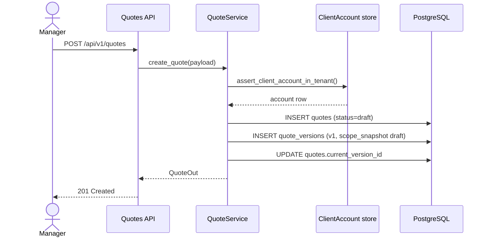
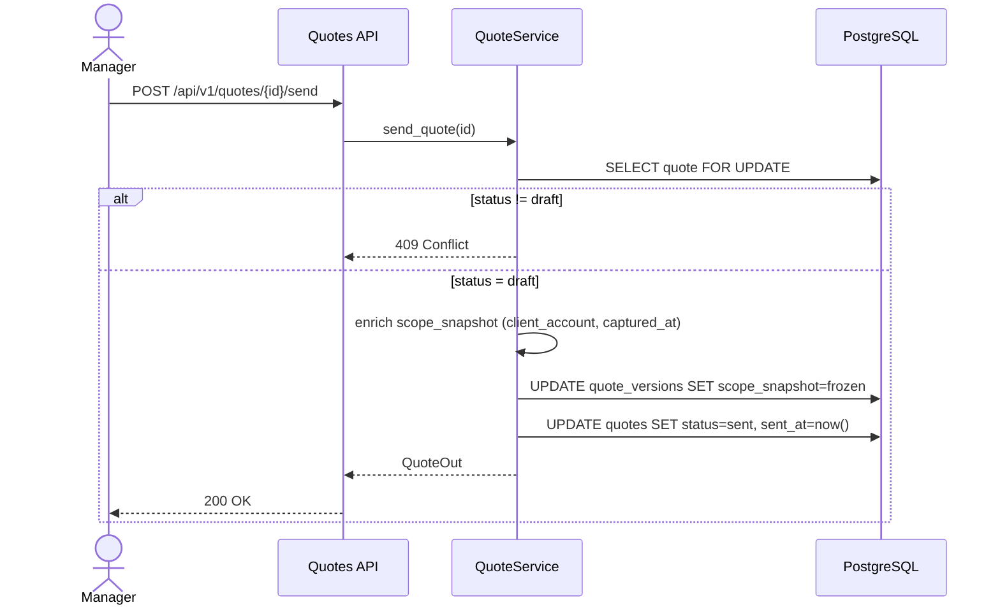
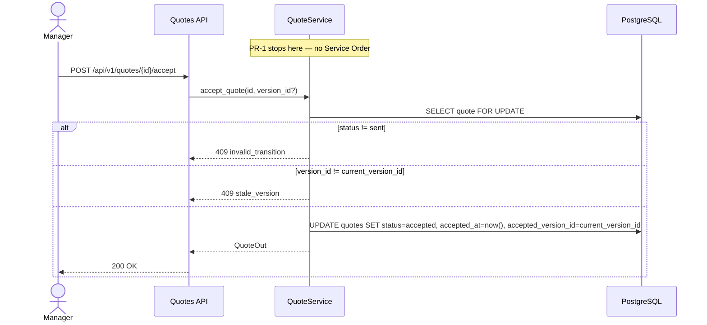
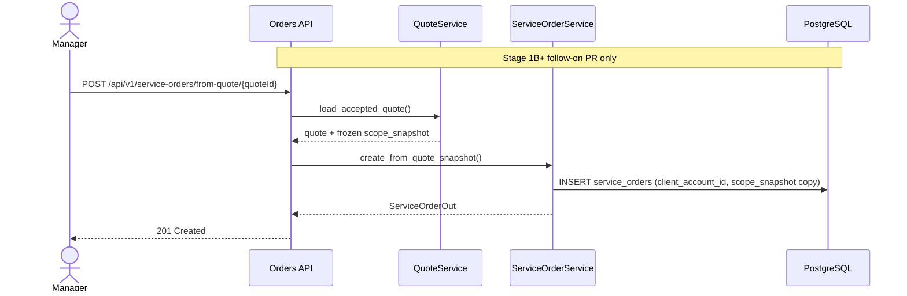
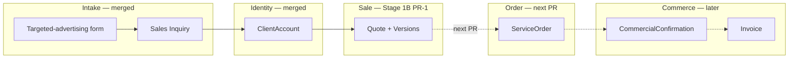

# Stage 1B — Quote Lifecycle Sequences

**Status:** design-first  
**Parent:** [`stage-1b-quote-foundation-implementation-contract.md`](../tasks/stage-1b-quote-foundation-implementation-contract.md)

---

## 1. Create draft quote

---

## 2. Send quote (freeze snapshot)

---

## 3. Accept quote (Sale layer only)

---

## 4. Future: Quote → Service Order (next PR — not implemented)

---

## 5. Boundary diagram (vertical isolation)

---

## 6. Recovery / legacy paths (no Quote interaction)

Auto-seed and lazy ensure remain in **intake** vertical. Quote PR must not modify:

- `provision_targeted_advertising_*`
- `ensure_tenant_targeted_advertising_intake_form`
- Questionnaire invite resolution

Legacy services tenants without quote rows continue to work; first quote is explicit user action.
