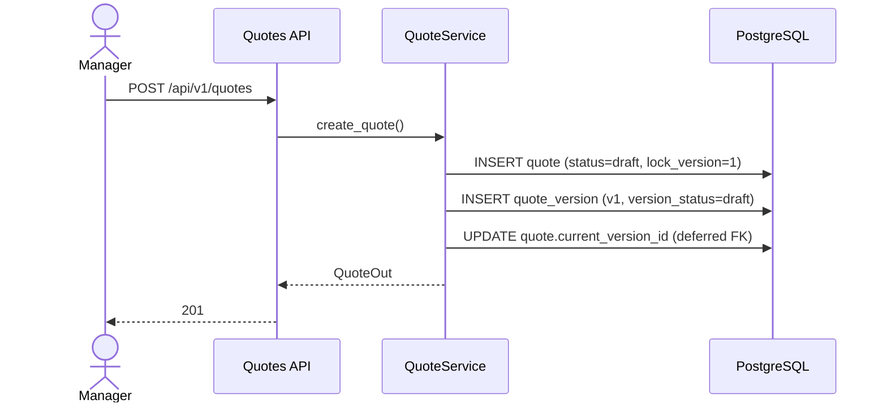
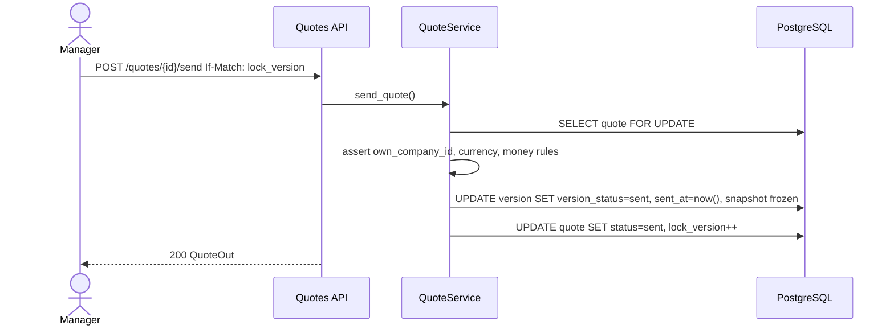
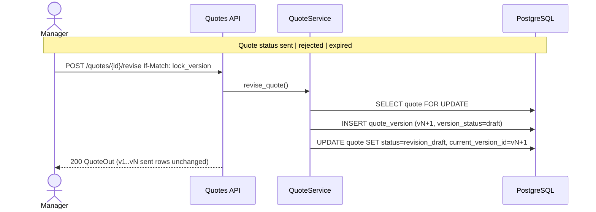
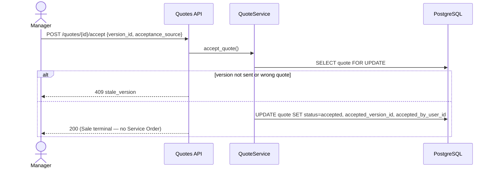
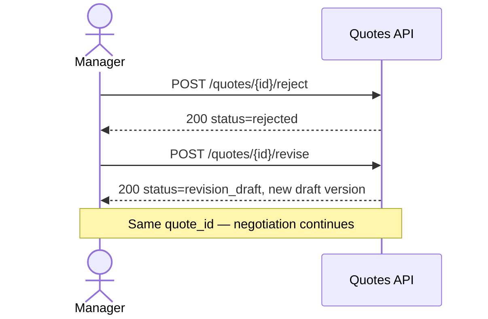
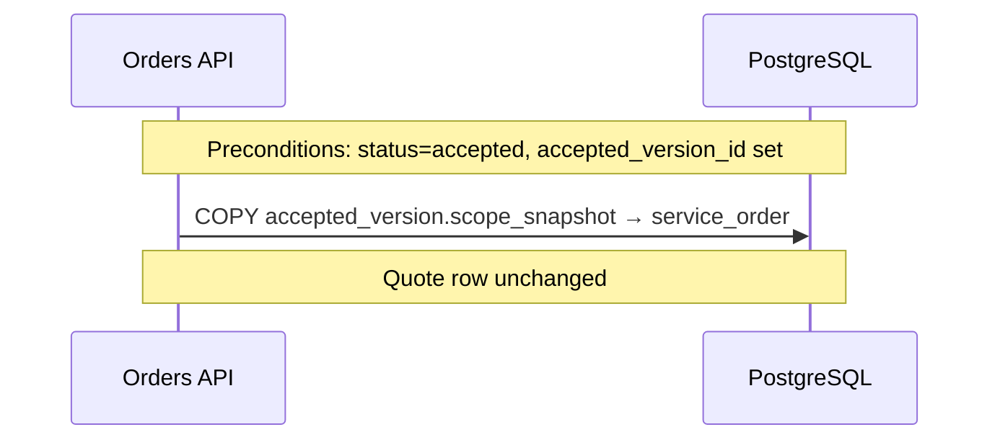

# Stage 1B — Quote Lifecycle Sequences

**Status:** design-first (revision 2)  
**Parent:** [`stage-1b-quote-foundation-implementation-contract.md`](../tasks/stage-1b-quote-foundation-implementation-contract.md)

---

## 1. Create draft quote

---

## 2. Send quote (freeze version)

---

## 3. Counter-offer (revise)

---

## 4. Accept specific sent version

---

## 5. Reject → revise (same thread)

---

## 6. Quote → Service Order (next PR)

---

## 7. Vertical isolation

Quote sequences do not touch intake/provisioning (`provision_targeted_advertising_*`, questionnaire invite).
