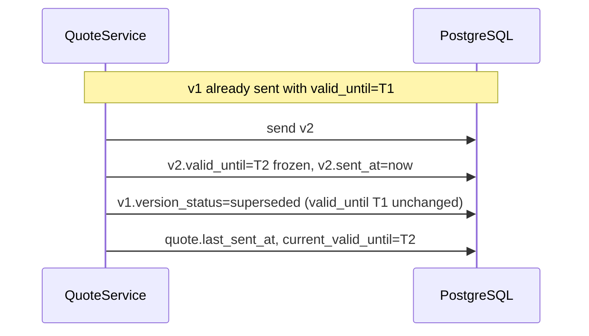
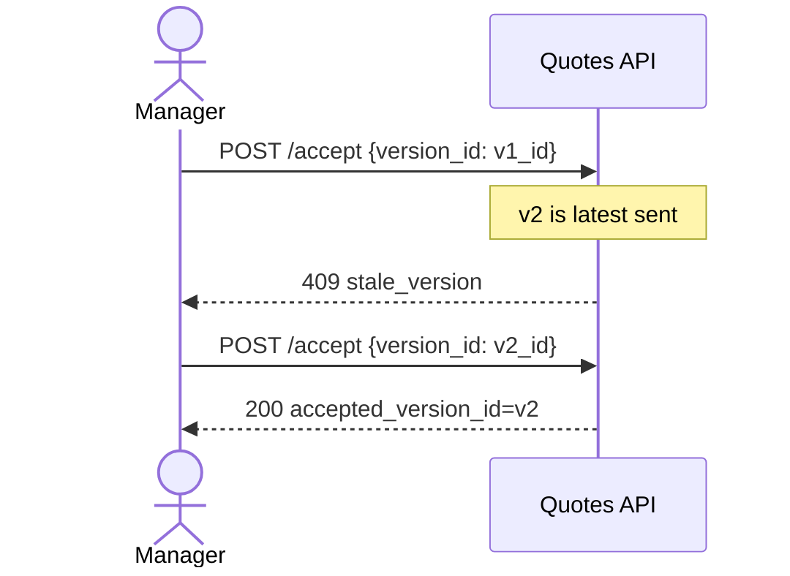

# Stage 1B — Quote Lifecycle Sequences

**Status:** design-first (revision 3)

---

## 1. Send v2 after revise (valid_until + supersede)

---

## 2. Accept — latest sent only

---

## 3. Expire

Checks `latest_sent_version.valid_until`, sets `last_expired_at`.

---

## 4. Reject → revise (same quote_id)

Negotiation continues without new Quote aggregate.
